### 一、一些基本术语

- 一组记录的集合称为一个数据集`data set​`，其中每条记录是关于一个事件或对象的描述，称为一个“**示例**”`instance`或“**样本**”`sample`    （**样例`example`=示例+标记**）
  - `e.g.`一批西瓜（色泽=青绿，根蒂=蜷缩，敲声=浊响），（色泽=乌黑，根蒂=稍蜷，敲声=沉闷），...
  - 记录中反映其描述对象在某方面的表项或性质的事项，称为“**属性**”`attibute`或特征`feature`，即上述例子中的“色泽”“根蒂”敲声”
  - 属性上的取值称为**属性值**`attribute value`，及上述例子中的“青绿”“蜷缩”
  - 属性张成的空间称为**属性空间**、**样本空间**或**输入空间**。`e.g.`把“色泽”“根蒂”“敲声”作为三个坐标轴，则它们张成一个用于描述西瓜的三维空间，每个西瓜都可以在这个空间中找到自己的坐标位置。空间中每个点对应一个坐标向量，所以一个示例也叫作一个**特征向量**
  - 总的来说，令$D=\{x_1,x_2,...,x_n\}$表示一个包含$m$个示例的数据集（这里的$x_i$都是向量，`typora`的公式里没法加粗，后面就都用带箭头的向量来表示），每个示例$\overrightarrow{x_i}$有$d$个属性描述，如上述西瓜有3个属性，那么每个示例$\overrightarrow{x_i}=(x_{i1},x_{i2},...,x_{id})$是$d$维样本空间$\chi$中的一个向量, $x_{ij}$是$\overrightarrow{x_i}$在第$j$个属性上的取值，$d$称为样本$\overrightarrow{x_i}$的**维度**
- 学习`learning`：从数据中学得模型的过程，也叫作训练`training`。训练过程中使用的数据称为**训练数据**，其中每个样本是**训练样本**，训练样本组成的集合称为**训练集**
  - 训练集：一组训练样例
  - 测试集：一组测试样例
- 我们需要的是一个能够帮助我们判断**这个瓜是不是好瓜的模型**，所以除了前面三个特征数据，还需要获取训练样本的**“结果”**信息，来建立这样一个**“预测”**的模型，这个结果信息，即好/坏瓜，称为**标记**`label`，那么一个完整的样本（将标记看作一个样本的一部分）就是$(\overrightarrow{x_i},y_i)$，其中$y_i\in\gamma$是$\overrightarrow{x_i}$的标记，$\gamma$是所有标记的集合，称为**标记空间**或**输出空间**。这里输出空间就对应了之前的输入空间。输入一个示例-->得到一个标记的输出
- 预测任务：根据标记的完整情况
  - 监督学习：所有示例都有标记。给出一个数据集(`data set `)即一部分输入和输出的正确对应
    - 回归`regression problem`：预测连续值的输出 （`e.g.`瓜的成熟度`0.95, 0.37`）
    - 分类`classification problem`：预测一个离散值的输出（`e.g. 0/1`；好瓜、坏瓜；年龄1,2,3,...岁）
    - 二分类（正类、反类）
      - 多分类
  - 无监督学习：所有示例都没有标记
    - 聚类：没有标记，对示例进行自动分组，比如本地瓜、外地瓜
  - 半监督学习：少量示例有标记，大量示例没标记
  - 噪音标记学习：标记有，但是不完全准确

- 根本目标：泛化能力——学得模型适用于新样本的能力
  - 也可以理解为：应对未来未见测试样本的能力
  - 未来是未知的，一般要依靠历史数据来逼近模型的泛化能力
  - 历史和未来来自相同分布（独立同分布`IID`假设）--> 可以通过历史的数据来预测未来
- 概念学习
  - 最早的学习方法（有些过于理想化），从训练数据中学得概念
  - `e.g.`用上面瓜的例子，要学习目标是是否是好瓜，暂且假设这可以由那三个属性完全确定。
  - 那么就有这样的布尔表达式：$好瓜\leftrightarrow(色泽=？)\wedge(根蒂=？)\wedge(敲声=？)$。问号代表尚未确定的取值，我们的任务就是**通过对训练集中样例的学习，把问号的内容确定下来**。
  - 刚才说到我们学习的目的是**泛化能力**，即要通过学习训练集中的瓜，来获得能够对**没见过的瓜也进行判断**的能力
- 假设空间、版本空间、归纳偏好：书`p5`
- `No Free Lunch`定理：书`p8, 9`

### 二、模型评估与选择

- 经验误差

  - **错误率**：分类错误的样本占样本总数的比例。即在$m$个样本中有$a$个样本分类错误，则错误率$E=\frac{a}{m}$；相应的，$1-\frac{a}{m}$称为**精度**
  - **误差**：预测输出和样本真实输出之间的差异
    - 训练集上的误差叫做**训练误差**或**经验误差**
    - 新样本上的误差称为**泛化误差**

- **过拟合与欠拟合**：书`p24 25`

- **评估方法**：现在只有一个包含$m$个样例的数据集$D={(x_1,y_1),...,(x_m,y_m)}$，既要训练，又要测试，所以必须要对$D$进行适当的处理，从中产生训练集$S$，和测试集$T$ （需要注意的是，**我们期望评估的是用$D$训练出的模型**，但是我们只有$D$，不得不划分出训练集和测试集）

  - **留出法**`(hold-out)`：直接将$D$划分为两个互斥的集合，其中一个作为训练集$S$，一个作为测试集$T$，即$D=S\bigcup T, S\bigcap T=\varnothing$

    - 划分要注意保持数据分布的一致性，即划分时保持样本的类别比例相似（**分层采样**）。`e.g.`$D$包含$500$个正例，$500$个反例，要划分成含$70\%$样本的训练集和$30\%$的测试集，那么训练集就要包含约$350$个正例，$350$个反例，测试集同理
    - 但是，测一次会有不确定性（拿上面那个例子来说，因为只限定了分层采样，没有限制具体训练集中$350$个正/反例是如何从$500$个中取出来的），所以一般要采用若干次随机划分、重复实验取平均值作为结果
    - 训练/测试样本数通常选$2:1\sim4:1$之间，即约$\frac23$到$\frac45$的样本用于训练

  - **交叉验证法**`(cross-validation)`

    - 将数据集分层采样划分为$k$个大小相似的互斥子集，每次用$k-1$个子集的并集作为训练集，剩下一个作为测试集。那么就可以测$k$次（每组都当过一次测试集），最终返回$k$个测试结果的均值，$k$最常用的取值为$10$(数据比较大时用$10$，小的时候可以选$3$或$5$)。称为“**k折交叉验证**”

    - 即$D=D_1\bigcup D_2\bigcup...\bigcup D_k,\ D_i\bigcap D_j=\varnothing(i\neq j)$

      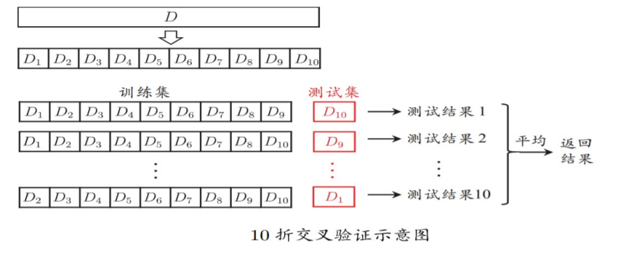

    - 同样，划分时要保持类别一致，随机划分重复$p$次取均值，称为“**p次k折交叉验证**”。测试总次数：$p\times k$

  - **留一法**`(Leave-One-Out, LOO)`：$k$折交叉验证法中，记数据集$D$包含$m$个样本，令$k=m$，即每组有且仅有一个样本。

    - 不用受划分方式的影响了（直接一个样本一组）
    - 训练集包含$m-1$组，也即$m-1$个样本，只比数据集少了一个样本，评估结果会比较准确，与用$D$训练出的模型的期望效果相近。
    - 但是数据集比较大时，$k$次测试的开销也会很大，所以**实际中不采用该方法**

  - **自助法**

    - 一开始提到我们希望评估的是用$D$训练处的模型，除了留一法开销过大，另外两种方法都不可避免地导致实际训练的训练集比$D$小（无法忽略的小），会与期望效果有一定偏差，那么有什么办法能降低训练样本规模差距造成的影响，并且能高效估计的方法呢？
    - 要引入自助法。记$D$包含$m$个样本，对它进行下述采样获得另一个数据集$D'$：每次随机从$D$中挑出一个样本，拷贝放入$D'$，让后再放回$D$中（类似**有放回的抽样**），重复取$m$次。
      - 显然，$D$中的一部分样本可能会在$D’$中重复出现，还有一部分不会出现。易见，每个样本在$m$次采样中均没有被取到的概率是$(1-\frac1m)^m$，$m\rightarrow \infin$时概率为$\frac1e\approx0.368$，即通过自助采样，$D$中约有$36.8\%$的样本没有出现在$D'$中，于是我们用$D'$作训练集，`D\D'`作测试集
      - 这样，训练集也用到了$m$个样本（和$D$一样大），并且依旧有约$\frac13$的样本用作了测试集
    - 数据集较小、划分较困难时比较有用。并且自助法能产生多个不同的训练集。
    - 但是，自助法产生的$D'$依旧是改变了数据集的分布，会引入偏差。所以在初始数据两足够时，还是常用留出法和交叉验证法

- **调参**：大多数学习算爆发都有些参数需要设定，比如树长多长、神经网络里节点设置多少个等等

  - 验证集：书`p28` https://blog.csdn.net/qq_43741312/article/details/96994243

- **性能度量**：给定样例集$D={(\overrightarrow{x_1},y_1),...,(\overrightarrow{x_m},y_m)}$， 其中$y_i$是$\overrightarrow{x_i}$的真实标记，评估学习器$f$的性能，就要把学习器的预测结果$f(\overrightarrow x)$与真实标记$y$进行比较

  - **回归任务**常用**均方误差** $E(f;D)=\frac1m\sum_{i=1}^m(f(\overrightarrow{x_i})-y_i)^2$

    - 为什么要用平方？因为首先，预测结果和真实标记的差存在正负，要将正负消解掉，就有两个选择：绝对值或平方。 绝对值不可导，不稳定。

  - **分类任务**使用**错误率**和**精度**：

    $E(f;D)=\frac1m\sum_{i=1}^mⅡ(f(\overrightarrow{x_i})\neq y_i)$

    $acc(f;D)=\frac1m\sum_{i=1}^mⅡ(f(\overrightarrow{x_i})=y_i)=1-E(f;D)$

  - 但是，现实中很多任务，比如信息检索、$Web$搜索中经常需要衡量**正例被预测出来的比率**或者**预测出来的正例中正确的比率**，以瓜为例，我用上述度量方法可以知道**有多少瓜被判断错误**，而如果我想知道这些瓜中**有多少的比例是好瓜**或者**所有的好瓜中被挑出来的占多少比例**，那么就要新的度量方法：**查准率**和**查全率**

    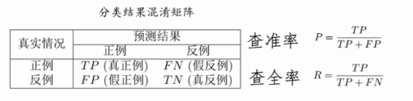

    - **查准率`precision`**：预测的正例中**真正**的正例的比例（预测的准不准）

    - **查全率`recall`**：**真正**预测对的占全部对的比率

      这俩是一对**矛盾**的度量，考虑两个极端情况：

      （1）我就只预测一个正例（并且它确实是正例），那么我的查准率就是$100\%$，但还有其他很多正例我没有预测出来（或者说，我压根就没有预测），那么查全率就很低

      （2）我把所有的预测都是正例，那么查全率一定是$100\%$，但查准率显然会很低

    - 那么，不能单一看其中一个，我们就要找一个平衡点

      - 根据学习器的结果对样例排序，排在前面的是学习器认为的最可能是正例的，后面的是它认为的最不可能是正例的，按此顺序逐个将样本预测为正例，并记录每步下的查准率和查全率，做出**查准率-查全率曲线**，简称**P-R曲线**；若一个学习器的`P-R`曲线被另一个的完全包住，那么后者的性能优于前者

      

      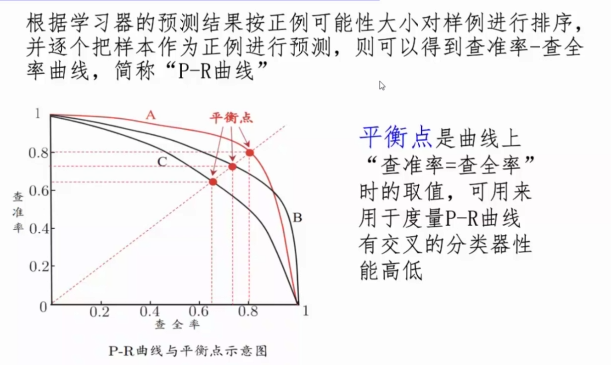

      三条曲线$ABC$中显然$A$的平衡点更高

      - 比$P-R曲线$更常用的是$F1$度量

        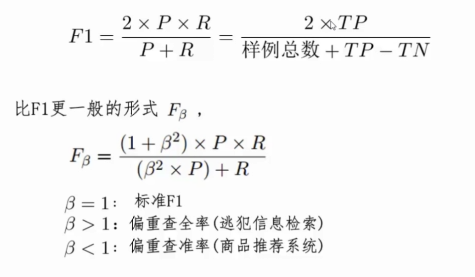

        - $F1$是对$PR$做一个**调和平均**，更一般的$F_{\beta}$，$\beta$决定偏重$P$还是$R$

  - **`ROC`曲线**

    - **分类**任务要对每个测试样本预测出一个值，并将其与一个**分类阈值**比较，比如预测出一个$[0,1.0]$的实值，与$0.5$比较，大的判为正例，小的判为反例。所以说，**预测出的实值好坏直接决定了学习器的泛化能力**

    - 做`P-R`曲线时，根据学习器的结果对样例排序，排在前面的是学习器认为的最可能是正例的，后面的是它认为的最不可能是正例的。类似上面的阈值，分类过程就变成在这个排序中找到一个**截断点`cut point`**将样本分成两部分，前一部分是正例，后一部分是反例

      - 对于不同的现实应用，如果更重视**查准率**，截断点可以靠前一些；如果更重视**查全率**，截断点可以靠后一些
      - 排序的质量决定了学习器在不同任务下的泛化性能好坏

    - $ROC$曲线就是从排序质量的角度来研究泛化性能的。按照排好的顺序逐个将样本预测为正例，并记录两个重要的值作为横纵坐标作图。

      - 纵轴是**真正例率`TPR`**，横轴是**假正例率`FPR`**，定义如下：

        $TPR = \frac{TP}{TP+FN}=R$等于查全率，即预测出来的真实正例占全部真实正例的比率

        $FPR=\frac{FP}{FP+TN}$，即预测出来的错误正例占全部反例的比率

        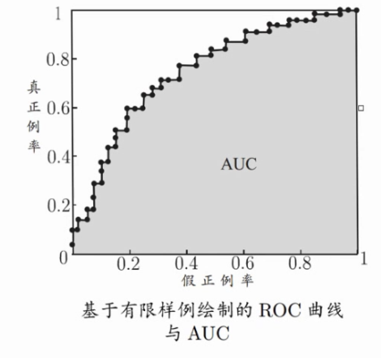

      - 首先我们只有有限个样本，所以无法画出光滑的曲线。点$(0,1)$对应了将所有正例排在了反例之前的理想模型

      - 其次，**绘图的过程**：记真实有$m^+$个正例，$m^-$个反例，根据预测结果对样例排序，

        - 将分类阈值设为最大，即所有样本都预测成反例，此时对应坐标原点$(0,0)$，
        - 然后依次将阈值设为每个样例的预测值，即**依次将每个样例划分为正例**。设上一个点的坐标为$(x,y)$，若当前这个预测的正例是真正例，那么其对应标记点的坐标为$(x,y+\frac1{m^+})$，若为假正例，那么其对应标记点的坐标为$(x+\frac1{m^-},y)$，然后直接用线段连接相邻点即可。

      - $ROC$曲线的比较：和$P-R$曲线类似，如果一条将另一条完全包住，那么前者对应学习器的性能优于后者；若发生交叉，难以直接断言，但是一定要比的话，就比较**$ROC$曲线下的面积**，称为$AUC$

        - $AUC$的计算：记$ROC$曲线是由坐标为${(x_1,y_1),(x_2,y_2),...,(x_m,y_m)}$的点按序连接而形成。则$AUC$可估算为许多小梯形的面积和：
          $$
          AUC=\frac12\sum_{i=1}^{m-1}(x_{i+1}-x_i)(y_{i+1}+y_i)
          $$

      - https://www.zhihu.com/question/265364451/answer/302612819

        $AUC$考虑的是排序质量，给定$m^+$个正例和$m^-$个反例，令$D^+$和$D^-$分别为正、反例集合，则排序损失记为：
        $$
        l_{rank}=\frac{1}{m^+m^-}\sum_{\overrightarrow{x}\in D^+}\sum_{\overrightarrow{x}\in D^-}(Ⅱ(f(\overrightarrow{x^+})<f(\overrightarrow{x^-}))\ +\ \frac12Ⅱ(f(\overrightarrow{x^+})=f(\overrightarrow{x^-})))
        $$
          考虑每一对正例、反例，若正例的预测值小于反例，则记一个**“罚分”**，若相等，则记$0.5$个罚分，可以看出$l_{rank}$对应$roc$曲线之上的面积，则有$AUC=1-l_{rank}$（具体为什么见上述链接）

### 三、线性模型

- **线性回归**

  - 离散属性处理

    - 属性间存在“序”的关系：通过连续化转化为连续值 比如将”优、良、中、差“定义为${1,2,3,4}$
    - 无“序”关系：有$k$个属性值，则转换为$k$维向量 比如将“西瓜 南瓜 黄瓜”定义为$(0,0,1),(0,1,0),(1,0,0)$

  - 单一属性的线性回归目标
    $$
    f(x)=w x_i+b使得f(x_i)\simeq y_i
    $$
    要让预测的结果接近$y_i$，就要使得$f(x_i)$和$y_i$的误差越小，之前说过使用**均方误差**，找到使得均方误差最小化的$\omega,\ b$
    $$
    (w^*,b^*)={argmin}_{(w,b)}\sum_{i=1}^m(f(x_i)-y_i)^2\\
    =argmin_{(w,b)}\sum_{i=1}^m(y_i-w x_i-b)^2\\w^*,b^*表示w,b的解
    $$
    均方误差对应了**欧氏距离**，而基于均方误差最小化来进行模型求解的方法称为“**最小二乘法`least square method`**”，线性回归任务中，最小二乘法就是找到一条直线，使**所有样本到直线上的欧式距离之和最小**

    最小二乘法具体怎么求解呢？

    - 最小化均方误差$E_{(\omega,b)}=\sum_{i=1}^m(y_i-\omega x_i-b)^2$

    - 分别对$\omega$和$b$求导：

$$
\frac{\partial E_{(w,b)}}{\partial w}=2(w\sum_{i=1}^mx_i^2-\sum_{i=1}^m(y_i-b)x_i)\tag1
$$

$$
\frac{\partial E_{(w,b)}}{\partial b}=2(mb-\sum_{i=1}^m(y_i-w x_i))\tag2
$$

令上述两式为$0$可以得到$w$和$b$的最优解的闭式解
$$
      w=\frac{\sum_{i=1}^my_i(x_i-\overline x)}{\sum_{i=1}^mx_i^2-\frac1m(\sum_{i=1}^mx_i)^2}
$$

$$
b=\frac1m\sum_{i=1}^m(y_i-wx_i)\\其中\overline x=\frac1m\sum_{i=1}^mx_i为x的均值
$$

- 为什么直接令导数为零得到的局部解就是全局最优解？**凸函数**（$U$型曲线的函数如$f(x)=x^2$通常是凸函数 https://www.zhihu.com/question/38724253

- **`m`个样本：`x`为样本特征** 上面是单一的线性回归目标，现在我们来看**多元**的
  $$
  (x_0^{(1)}, x_1^{(1)}, x_2^{(1)}, ...,x_n^{(1)}, y_1);\\
  (x_0^{(2)}, x_1^{(2)}, x_2^{(2)}, ...,x_n^{(2)}, y_2);\\
  .\\
  .\\
  .\\
  (x_0^{(m)}, x_1^{(m)}, x_2^{(m)}, ...,x_n^{(m)}, y_m)
  $$

  - 多元线性回归目标：
    $$
    f(\overrightarrow x)=\overrightarrow w^T \overrightarrow{x_i}+b使得f(\overrightarrow{x_i})\simeq y_i
    $$
    

- **对数线性回归**

  - 我们把线性回归模型简记为
    $$
    y=\overrightarrow w^{\rm T}\overrightarrow x+b
    $$
    讲输出标记的对数作为线性模型逼近的目标，则有
    $$
    \ln y=\overrightarrow w^{\rm T}\overrightarrow x+b
    $$
    也就是说，让$e^{\overrightarrow w^{\rm T}\overrightarrow x+b}$逼近$y$

- 更一般地，考虑单调可微函数$g(·)$，令$y=g^{-1}(\overrightarrow w^{\rm T}\overrightarrow x+b)$，这样得到的模型称为“**广义线性模型**”，其中函数$g(·)$称为**联系函数**，$g(·)=ln(·)$时就成为对数线性回归

- **对数几率回归**

- 我们已经懂了如何使用线性模型进行**回归任务**，那么如果是**分类任务**应该怎么办？ 答案就是找一个单调可微函数$g(·)$，将分类任务的真实标记$y$与线性回归模型的预测值联系起来。

- 对于二分类任务，输出标记$y\in\{0,1\}$，而线性回归产生的预测值$z=\overrightarrow w^{\rm T}\overrightarrow x+b$是实数，所以需要将该实值转换为$0/1$，最理想的就是**单位阶跃函数**
  $$
  \begin{cases}
  0,&z<0\\
  0.5,&z=0\\
  1,&z>0
  \end{cases}
  $$
  即预测值$z$大于0时判为正例，小于0时判为反例，为临界值时可以任意判

  但是，单位阶跃函数有个致命的问题：**不连续**，不能作为联系函数，而**对数几率函数**就是一个常用的替代：
  $$
  y=\frac1{1+e^{-z}}=\frac1{1+e^{\overrightarrow w^{\rm T}\overrightarrow x+b}}
  $$
  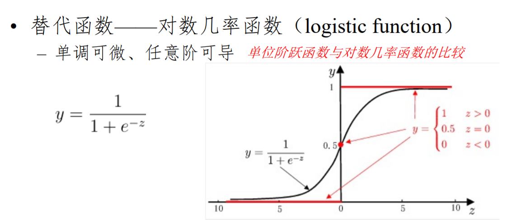

  - 上式可变化为：
    $$
    \ln\frac{y}{1-y}=\overrightarrow w^{\rm T}\overrightarrow x+b\tag{*}
    $$
    若将$y$视为样本$x$作为正例的可能性，则$1-y$是其反例的可能性，二者的比值$\frac y{1-y}$称为“几率”，反映了$x$作为正例的**相对可能性**，取对数$\ln\frac{y}{1-y}$就得到对数几率。

    那么，就变成了我们用线性回归模型的预测结果去逼近真实标记的对数几率，对应的模型就称为“对数几率回归”，说是叫回归，但其实完成的是二分类任务。

  - 如何选取$*$式中的$w和b$？若将$*$式中的$y$视为类后验概率$p(y=1|x)$，则$*$式可以写为
    $$
    \ln\frac{p(y=1|x)}{p(y=0|x)}=\overrightarrow w^{\rm T}\overrightarrow x+b\tag{*}
    $$
    又由于两者和为1，则有
    $$
    p(y=1|x)=\frac{e^{\overrightarrow w^{\rm T}\overrightarrow x+b}}{1+e^{\overrightarrow w^{\rm T}\overrightarrow x+b}}\\
    p(y=0|x)=\frac1{1+e^{\overrightarrow w^{\rm T}\overrightarrow x+b}}\\
    不妨上述两式简记为p_1,p_0
    $$

下面通过**极大似然法**来估计$w$和$b$

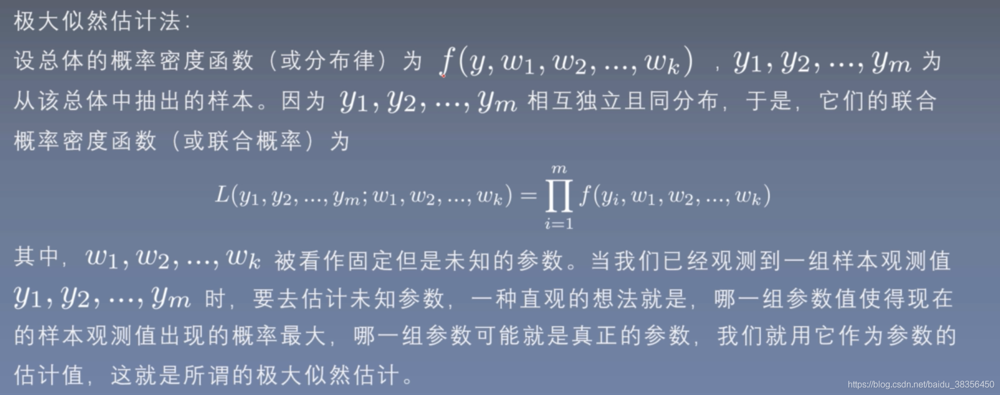

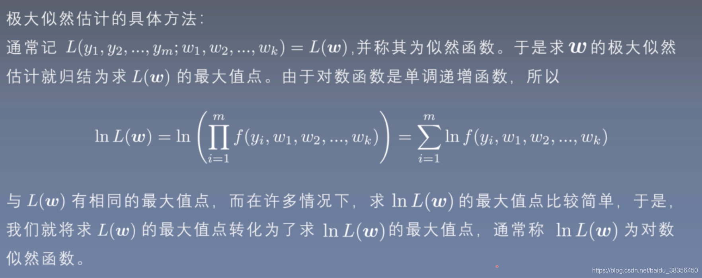
$$
l(\overrightarrow w,b)=\sum_{i=1}^m\ln p(y_i|\overrightarrow {x_i};\overrightarrow w,b)\tag0\\
其中p(y_i|\overrightarrow {x_i};\overrightarrow w,b)=y_ip_1+(1-y_i)p_0,y_i\in \{0,1\}
$$
将$\overrightarrow w^{\rm T}\overrightarrow x+b$简记为$\overrightarrow \beta^{\rm T}\hat{\bold x}$
$$
则p_1=\frac{e^{\overrightarrow \beta^{\rm T}\hat{\bold x}}}{1+e^{\overrightarrow \beta^{\rm T}\hat{\bold x}}}\\
p_0=\frac{1}{1+e^{\overrightarrow \beta^{\rm T}\hat{\bold x}}}\\
$$
代入0式可得：
$$
\begin{align*}
l(\overrightarrow \beta)&=\sum_{i=1}^m\ln [y_i\frac{e^{\overrightarrow \beta^{\rm T}\hat{\bold x_i}}}{1+e^{\overrightarrow \beta^{\rm T}\hat{\bold x_i}}}+(1-y_i)\frac{1}{1+e^{\overrightarrow \beta^{\rm T}\hat{\bold x_i}}}]\\
&=\sum_{i=1}^m[\ln(y_ie^{\overrightarrow \beta^{\rm T}\hat{\bold x_i}}+1-y_i)-\ln(1+e^{\overrightarrow \beta^{\rm T}\hat{\bold x_i}})]
\end{align*}
$$
然后，可以发现，当$y_i=0时$，上式就变成：
$$
l(\overrightarrow \beta)_{y=0}=\sum_{i=1}^m[-\ln(1+e^{\overrightarrow \beta^{\rm T}\hat{\bold x_i}})]
$$
当$y_i=1$式，上式变成：
$$
l(\overrightarrow \beta)_{y=1}=\sum_{i=1}^m[e^{\overrightarrow \beta^{\rm T}\hat{\bold x_i}}-\ln(1+e^{\overrightarrow \beta^{\rm T}\hat{\bold x_i}})]
$$
那么
$$
\begin{align*}
l(\overrightarrow \beta)&=y_il(\overrightarrow \beta)_{y_i=1}+(1-y_i)l(\overrightarrow \beta)_{y_i=0}\\
&=\sum_{i=1}^m[y_i\overrightarrow \beta^{\rm T}\hat{\bold x_i}-\ln(1+e^{\overrightarrow \beta^{\rm T}\hat{\bold x_i}})]
\end{align*}
$$
我们要的是这个的最大值，取个负号就是求下式的最小值：
$$
l(\overrightarrow \beta)=\sum_{i=1}^m[-y_i\overrightarrow \beta^{\rm T}\hat{\bold x_i}+\ln(1+e^{\overrightarrow \beta^{\rm T}\hat{\bold x_i}})]\tag1
$$
求解过程（牛顿法）见书$p59$

- **线性判别分析`LDA`**

  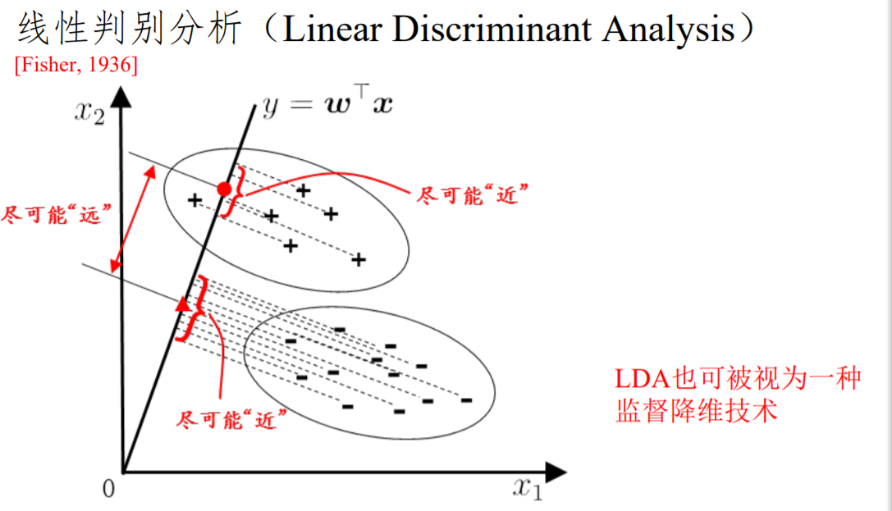

- 给定训练样例集，设法将样例投影到一条直线上，**同类样例的投影点尽可能近，异类样例的投影点尽可能远**；在对新样本进行分类时，也将其投影到该直线上，再根据投影点位置确定其类别

- 从几何的角度，让全体训练样本经过投影后，

    - 异类样本的中心尽可能远
    
    - 同类样本的方差尽可能小
    
- 给定数据集$D=\{(\overrightarrow x_i,y_i)\}_{i=1}^m,y_i\in \{0,1\}$，令$X_i,\overrightarrow\mu_i,\Sigma_i$分别为正/反例样本的集合、均值向量、协方差矩阵，即
  $$
  X_1=\{(\overrightarrow x_i,y_i)|\ y_i=1\}\\
  X_0=\{(\overrightarrow x_i,y_i)|\ y_i=0\}\\
  \overrightarrow{\mu_1}=\frac{1}{|X_1|}\sum_{(\overrightarrow x_i,y_i)\in X_1}\overrightarrow x_i\\
  \overrightarrow{\mu_0}=\frac{1}{|X_0|}\sum_{(\overrightarrow x_i,y_i)\in X_0}\overrightarrow x_i\\
  \Sigma=\left[\begin{matrix}
  {\rm cov}(\overrightarrow x_1,\overrightarrow x_1)&{\rm cov}(\overrightarrow x_1,\overrightarrow x_2)& ...&{\rm cov}(\overrightarrow x_1,\overrightarrow x_m)\\
  {\rm cov}(\overrightarrow x_2,\overrightarrow x_1)&{\rm cov}(\overrightarrow x_2,\overrightarrow x_2)& ...&{\rm cov}(\overrightarrow x_2,\overrightarrow x_m)\\
  .&.& ...&.\\
  .&.& ...&.\\
  .&.& ...&.\\
  {\rm cov}(\overrightarrow x_m,\overrightarrow x_1)&{\rm cov}(\overrightarrow x_m,\overrightarrow x_2)& ...&{\rm cov}(\overrightarrow x_m,\overrightarrow x_m)\\
  \end{matrix}\right]\\
  其中{\rm cov}(\overrightarrow x_i,\overrightarrow x_j)={\rm E}[(\overrightarrow x_i-{\rm E}(\overrightarrow {{x_i}}))(\overrightarrow x_j-{\rm E}(\overrightarrow {{x_j}}))]\\
  ={\rm E}[(\overrightarrow x_i- {\overline{x_i}})^{\rm T}(\overrightarrow x_j- {\overline{x_j}})]\\
  ={\rm E}[\sum_{k=1}^m(x_{ik}-\overline{x_i})(x_{jk}-\overline{x_j})]\\
  对于样本的协方差矩阵\ 我们直接去掉期望看里面的内容，即\\
  \Sigma=\left[\begin{matrix}
  \sum_{k=1}^m(x_{1k}-\overline{x_1})(x_{1k}-\overline{x_1})&\sum_{k=1}^m(x_{1k}-\overline{x_1})(x_{2k}-\overline{x_2})& ...&\sum_{k=1}^m(x_{1k}-\overline{x_1})(x_{mk}-\overline{x_m})\\
  \sum_{k=1}^m(x_{2k}-\overline{x_2})(x_{1k}-\overline{x_1})&\sum_{k=1}^m(x_{2k}-\overline{x_2})(x_{2k}-\overline{x_2})& ...&\sum_{k=1}^m(x_{2k}-\overline{x_2})(x_{mk}-\overline{x_m})\\
  .&.& ...&.\\
  .&.& ...&.\\
  .&.& ...&.\\
  \sum_{k=1}^m(x_{mk}-\overline{x_m})(x_{1k}-\overline{x_1})&\sum_{k=1}^m(x_{mk}-\overline{x_m})(x_{2k}-\overline{x_2})& ...&\sum_{k=1}^m(x_{mk}-\overline{x_m})(x_{mk}-\overline{x_m})\\
  \end{matrix}\right]\\
  =\sum_{i=1}^m(\overrightarrow x_i-\mu)(\overrightarrow x_i-\mu)^{\rm T}\\
  那么\Sigma_1=\sum_{\overrightarrow x_i\in X_1}^m(\overrightarrow x_i-\mu)(\overrightarrow x_i-\mu)^{\rm T}\\
  \Sigma_0=\sum_{\overrightarrow x_i\in X_0}^m(\overrightarrow x_i-\mu)(\overrightarrow x_i-\mu)^{\rm T}
  $$

  - 要找到一条直线$y=\overrightarrow w^{\rm T}\overrightarrow x+b$，使得

    - 两类样本的中心在该直线上的投影尽可能远

    投影长度分别为：

    $|\overrightarrow\mu_0|\cos\theta_0$，其中$\theta_0$为$\overrightarrow\mu_0$和该直线的夹角

    $|\overrightarrow\mu_1|\cos\theta_1$，其中$\theta_1$为$\overrightarrow\mu_1$和该直线的夹角

    那么就是要确定$\overrightarrow w,b$，使得有$max||\ |\overrightarrow\mu_0|\cos\theta_0-|\overrightarrow\mu_1|\cos\theta_1||_2^2$

    两数同乘上$|\overrightarrow w|$:   $|\overrightarrow w||\overrightarrow\mu_0|\cos\theta_0-|\overrightarrow w||\overrightarrow\mu_1|\cos\theta_1$

    **正好就是$\overrightarrow w^{\rm T}\overrightarrow\mu_0-\overrightarrow w^{\rm T}\overrightarrow\mu_1$ 要使得这个式子最大**

    对应上了书上所说的“投影”

    - 同类样本的方差尽可能小(也就是书上说的“协方差”) 以反例为例，我们的方差就是：
      $$
      \sum_{\overrightarrow x_i\in X_0}(\overrightarrow w^{\rm T}\overrightarrow x_i-\overrightarrow w^{\rm T}\overrightarrow\mu_0)(\overrightarrow x_i^{\rm T}\overrightarrow w-\overrightarrow \mu_0^{\rm T}\overrightarrow w) \ \ 对应了方差的公式\sum(x-\overline x)^2\\
      而上式又等于：\\
      \overrightarrow w^{\rm T}(\sum_{\overrightarrow x_i\in X_0}(\overrightarrow x_i-\mu)(\overrightarrow x_i-\mu)^{\rm T})\overrightarrow w\\
      =\overrightarrow w^{\rm T}\Sigma_0\overrightarrow w
      $$
      这也对应了书上说的协方差

  - 那么我们的优化目标就有了：
    $$
    J=\frac{||\overrightarrow w^{\rm T}\overrightarrow\mu_0-\overrightarrow w^{\rm T}\overrightarrow\mu_1||_2^2}{\overrightarrow w^{\rm T}\Sigma_0\overrightarrow w+\overrightarrow w^{\rm T}\Sigma_1\overrightarrow w}
    $$
    要分子尽可能大，分母尽可能小，所以就是要$J$尽可能大

    式子再化简一下：
    $$
    \begin{align*}
    J&=\frac{||\overrightarrow w^{\rm T}\overrightarrow\mu_0-\overrightarrow w^{\rm T}\overrightarrow\mu_1||_2^2}{\overrightarrow w^{\rm T}\Sigma_0\overrightarrow w+\overrightarrow w^{\rm T}\Sigma_1\overrightarrow w}\\
    \\
    &=\frac{||(\overrightarrow w^{\rm T}\overrightarrow\mu_0-\overrightarrow w^{\rm T}\overrightarrow\mu_1)^{\rm T}||_2^2}{\overrightarrow w^{\rm T}(\Sigma_0+\Sigma_1)\overrightarrow w}\\\\
    &=\frac{||(\overrightarrow\mu_0-\overrightarrow\mu_1)^{\rm T}\overrightarrow w||_2^2}{\overrightarrow w^{\rm T}(\Sigma_0+\Sigma_1)\overrightarrow w}\\\\
    &=\frac{[(\overrightarrow\mu_0-\overrightarrow\mu_1)^{\rm T}\overrightarrow w]^{\rm T}(\overrightarrow\mu_0-\overrightarrow\mu_1)^{\rm T}\overrightarrow w}{\overrightarrow w^{\rm T}(\Sigma_0+\Sigma_1)\overrightarrow w}\\\\
    &=\frac{\overrightarrow w^{\rm T}(\overrightarrow\mu_0-\overrightarrow\mu_1)(\overrightarrow\mu_0-\overrightarrow\mu_1)^{\rm T}\overrightarrow w}{\overrightarrow w^{\rm T}(\Sigma_0+\Sigma_1)\overrightarrow w}
    \end{align*}
    $$
    然后我们将$(\overrightarrow\mu_0-\overrightarrow\mu_1)(\overrightarrow\mu_0-\overrightarrow\mu_1)^{\rm T}$这一$m{\times}m$方阵简记为$S_b$，$\Sigma_0+\Sigma_1$记为$S_w$，则
    $$
    J=\frac{\overrightarrow w^{\rm T}S_b\overrightarrow w}{\overrightarrow w^{\rm T}S_w\overrightarrow w}
    $$
    要优化这个式子，获取其取最大值的$\overrightarrow w$，但是可以发现，硬解是解不出来的，因为分子分母只有中间的$m\times m$矩阵不同（都是$\overrightarrow w$的二次项），$\overrightarrow w$的**模长对该式子没有任何影响**

    所以我们可以固定一下$\overrightarrow w$的模长，书上是直接固定分母$\overrightarrow w^{\rm T}S_w\overrightarrow w=1$，那么最大化问题就可以化为：
    $$
    \min_{\overrightarrow w}-\overrightarrow w^{\rm T}S_b\overrightarrow w\\
    s.t.\overrightarrow w^{\rm T}S_w\overrightarrow w=1
    $$

  - 对于**仅含等式约束的优化问题**，使用**拉格朗日乘子法**，如下：
    $$
    \min_xf(x)\\
    s.t.\ h_i(x)=0\ \ i=1,2,...,n
    $$
    其中自变量$x\in \R^n$（这边偷个懒就不标向量箭头了），$f(x),h_i(x)$都有连续的一阶偏导数。首先列出其拉格朗日函数：
    $$
    L(x,\lambda)=f(x)+\sum_{i=1}^n\lambda_ih_i(x)
    $$
    其中$\lambda=(\lambda_1,\lambda_2,...,\lambda_n)^{\rm T}$为拉格朗日乘子，然后对拉格朗日函数关于$x$求偏导，令导数等于0再搭配约束条件$h_i(x)=0$解出$x$，求解出的所有$x$即为上述优化问题的**所有可能极值点**

  - 应用到该问题上就是：
    $$
    \min_{\overrightarrow w}-\overrightarrow w^{\rm T}S_b\overrightarrow w\\
    s.t.\overrightarrow w^{\rm T}S_w\overrightarrow w-1=0
    $$
    拉格朗日函数为：
    $$
    L(\overrightarrow w,\lambda)=-\overrightarrow w^{\rm T}S_b\overrightarrow w+\lambda(\overrightarrow w^{\rm T}S_w\overrightarrow w-1)
    $$
    对$\overrightarrow w$求偏导：
    $$
    \begin{align*}
    \frac{\partial L(\overrightarrow w,\lambda)}{\partial\overrightarrow w}&=-\frac{\partial(\overrightarrow w^{\rm T}S_b\overrightarrow w)}{\partial\overrightarrow w}+\lambda\frac{\partial(\overrightarrow w^{\rm T}S_w\overrightarrow w-1)}{\partial\overrightarrow w}\\
    &=-(S_b+S_b^{\rm T})\overrightarrow w+\lambda(S_w+S_w^{\rm T})\overrightarrow w
    \end{align*}
    $$
    由于根据上面$S_b,S_w$的推导可知，它俩都是对称阵，所以和它们各自的转置相等，故
    $$
    \frac{\partial L(\overrightarrow w,\lambda)}{\partial\overrightarrow w}=-2S_b\overrightarrow w+2\lambda S_w\overrightarrow w
    $$
    令其=0，得到
    $$
    S_b\overrightarrow w=\lambda S_w\overrightarrow w
    $$
    即
    $$
    (\overrightarrow\mu_0-\overrightarrow\mu_1)(\overrightarrow\mu_0-\overrightarrow\mu_1)^{\rm T}\overrightarrow w=\lambda S_w\overrightarrow w
    $$
    若令$(\overrightarrow\mu_0-\overrightarrow\mu_1)^{\rm T}\overrightarrow w=\gamma\in \R$，则
    $$
    \gamma(\overrightarrow\mu_0-\overrightarrow\mu_1)=\lambda S_w\overrightarrow w\\
    \overrightarrow w=\frac{\gamma}{\lambda}S_w^{-1}(\overrightarrow\mu_0-\overrightarrow\mu_1)
    $$
    由于我们要解的$\overrightarrow w$不关心其大小，只关心其方向，所以$\frac{\gamma}{\lambda}$可以取任意值，那就不妨令$\lambda=\gamma$，得到
    $$
    \overrightarrow w=S_w^{-1}(\overrightarrow\mu_0-\overrightarrow\mu_1)
    $$
    为最优解。

    - 注意，我们这里其实并没有严格考虑约束条件
      $$
      \overrightarrow w^{\rm T}S_w\overrightarrow w-1=0
      $$
      该约束条件其实是约束了$\overrightarrow w$的长度的，但是其实其长度大小并不影响优化目标，所以这边就没有考虑其长度

### 四、决策树

####  1、算法原理

- 逻辑角度：一堆$if\ else$语句的组合
- 几何角度：根据某种准则（判断条件）划分特征空间
- 最终目的：将样本越分越“纯”

#### 2、一些数学概念

- 自信息
  $$
  I(X)=-\log_bp(x)
  $$

- 信息熵（自信息的期望）：度量随机变量$X$的不确定性，**信息熵越大越不确定**
  $$
  H(X)=E[I(X)]=-\sum_xp(x)\log_bp(x)
  $$
  约定：若$p(x)=0$，则$p(x)\log_bp(x)=0$，可以发现，当$X$的某个取值的概率为1时，信息熵最小（也就是$X$最确定，是个常量，就是该值），当$X$的各个取值概率相等时信息熵最大（越不确定，符合我们现实中说，如果有一个取值的概率特别大，那这个变量就比较确定了；但是如果每个取值都等可能，那就不好确定了），信息熵值为$\log_b|X|$，其中$|X|$为$X$可能取值的个数

- 在决策树中的**信息熵**：

  - 将样本类别`label` $y$当作随机变量，每个类别在样本集合$D$中占比$p_k,k=1,2,...,|y|$视作值取到各个类别的概率，那么样本集合$D$的信息熵为（底数取2）
    $$
    {\rm Ent}(D)=-\sum_{k=1}^{|y|}p_k\log_2p_k
    $$
    此时该信息熵的不确定性可以理解为集合$D$内样本分类$y$的“纯度”  **值越小约纯**(某一类别的概率为1时信息熵为0，值最小)

- **条件熵**：$Y$的信息熵关于概率分布$X$的期望：在已知$X$后$Y$的不确定性
  $$
  H(Y|X)=\sum_xp(x)H(Y|X=x)
  $$
  对于某一个特征$a$，假设样本在该特征上的可能取值为$\{a^1,a^2,...,a^V\}$，$D^v$表示总样本集合$D$中特征$a$取值为$a^v\in \{a^1,a^2,...,a^V\}$的样本集合（即该集合中的所有样本在属性$a$上的取值都等于$a^v$，且$D$中所有在$a$上取值为$a^v$的样本都在$D^v$中），$\frac{|D^v|}{|D|}$表示占比，那么在已知特征$a$的取值后，样本集合$D$的条件熵为
  $$
  \sum_{v=1}^V\frac{|D^v|}{|D|}{\rm Ent}(D^v)
  $$
  这个也就是说，我如果根据某一特征$a$的取值对$D$进行划分，那么就对划分出来的各个子集求一个信息熵，然后乘上该子集大小在$D$中的比例，再将它们加起来就是$D$在已知特征$a$取值上的条件熵

- **信息增益**

  - 在已知特征$a$的取值后$y$的不确定性减少的量，即纯度的提升
    $$
    {\rm Gain}(D,a)={\rm Ent}(D)-\sum_{v=1}^V\frac{|D^v|}{|D|}{\rm Ent}(D^v)
    $$
    也就是，一开始划分前我这个集合$D$的不确定性，减去按特征$a$的取值划分后的不确定性，得到的就是$D$的纯度的增益

#### 3、决策树分类

- $ID3$决策树：以信息增益为准则来选择划分属性的决策树
  $$
  a_*=\arg\max_{a\in A}{\rm Gain}(D,a)
  $$

- $C4.5$决策树

  - 改进了$ID3$决策树

  - **信息增益原则的缺陷**：对**可能取值数目较多**的属性有所偏好

    - 比如说像“编号”这一极端情况，每个样本都有一个独立的不重复的编号，也就是说，如果按照编号划分子集，每个子集都有且仅有一个样本，显然$p_k=1$，那么条件熵就是0，信息增益会很大；但是这样子划分显然是没有意义的
    - 也就是说，有的属性的可能取值$\{a^1,a^2,...,a^V\}$特别多，条件熵会很小，最后得出的信息增益不具有代表性

  - 使用**增益率**代替信息增益
    $$
    {\rm Gain\_ratio}(D,a)=\frac{{\rm Gain}(D,a)}{{\rm IV}(a)}\\
    $$
    其中
    $$
    {\rm IV}(a)=-\sum_{v=1}^V\frac{|D^v|}{|D|}\log_2\frac{|D^v|}{|D|}
    $$
    称为属性$a$的**固有值**，$a$的可能取值个数$V$越大，通常其固有值${\rm IV}(a)$也越大

  - 但是 增益率也有缺陷

    - 对**可能取值较少**的属性有所偏好

  - 所以，$C4.5$据册数并未完全使用增益率代替信息增益，而是采用一种启发式的方法：

    **先选出信息增益高于平均水平的属性，然后再从中选择增益率最高的**

- $\rm CART$决策树

  - **基尼值**：从样本集合$D$中随机抽两个样本，其类别`label`不一样的概率
    $$
    \begin{align}
    {\rm Gini}(D)&=\sum_{k=1}^{|y|}\sum_{k'\neq k}p_kp_{k'}\\
    &=\sum_{k=1}^{|y|}p_k(1-p_k)\\
    &=1-\sum_{k=1}^{|y|}p_k^2
    \end{align}
    $$
    基尼值越小，即随机抽取两个样本，他们不是同一类的概率越小，纯度也就越高

    也就是说，我一个很纯的样本集合，随便抽两个样本出来，它俩都是同一类别的

  - **属性$a$的基尼指数**
    $$
    {\rm Gini\_index}(D,a)=\sum_{v=1}^V\frac{|D^v|}{|D|}{\rm Gini}(D^v)
    $$
    也就是按照属性$a$的不同取值划分后的各个子集的基尼值乘上其权重再相加

  - $\rm CART$决策树就是选择**基尼指数最小的属性**作为最优划分属性
    $$
    a_*=\arg\min_{a\in A}{\rm Gini\_index}(D,a)
    $$

#### 4、剪枝

有时候决策树分支过多，可能会过拟合，所以要主动剪去一些分支来降低过拟合的风险

- **预剪枝**：在决策树生成过程中，对每个结点在划分前进行估计，若当前节点的划分不能带来决策树泛化性能的提升，则停止划分并将该节点标记为叶节点
- **后剪枝**：先生成一棵完整的决策树，然后自底向上对非叶节点进行考察，若将该节点对应的子树整个替换成叶节点能提升泛化性能，那就替换
- 后剪枝通常比预剪枝保留了更多的分支，并且一般情况下，后剪枝的欠拟合风险很小，泛化性能更好一些，但是它是在决策树生成之后自底向上注意考察结点，所以时间开销比预剪枝大得多

#### 5、连续值处理

见书$p85$

#### 6、缺失值处理

有些样本的某些属性值缺失，直接丢弃会产生巨大浪费，那么如何处理呢？

- 需要解决两个问题

  - 如何在属性值缺失的情况下选择划分属性？
  - 给定划分属性，若有些样本在该属性上的值缺失，应该如何对样本划分？

- 对于第一个问题，我们只能根据$D$中没有缺失值的样本集来判断属性$a$是否可以作为划分属性

  - 记$D$中在属性$a$上没有缺失值的样本子集为$\tilde D$，假设$a$有$V$个可能取值$\{a^1,a^2,...,a^V\}$，$\tilde D^v$为$\tilde D$中在属性$a$上取值为$a^v$的样本集合，$\tilde D_k$表示$\tilde D$中属于第$k$类$(k=1,2,...,|y|)$的样本集合，我们对每个样本$\overrightarrow x$赋予一个权重$w_x$，并定义
    $$
    \begin{align}
    \rho&=\frac{\sum_{x\in \tilde D}w_x}{\sum_{x\in D}w_x}\\
    \tilde p_k&=\frac{\sum_{x\in \tilde D_k}w_x}{\sum_{x\in\tilde D}w_x}\\
    \tilde r_v&=\frac{\sum_{x\in \tilde D^v}w_x}{\sum_{x\in\tilde D}w_x}
    \end{align}
    $$
    也就是，对于属性$a$，$\rho$表示无缺失值样本所占的比例，$\tilde p_k$表示无确实样本中第$k$类的占比，$\tilde r_v$表示无缺失值样本中在属性$a$上取值$a^v$的样本占比

  - 基于上述的定义，可以将信息增益的公式推广为
    $$
    \begin{align}
    {\rm Gain}(D,a)&=\rho\times{\rm Gain}(\tilde D,a)\\
    &=\rho\times({\rm Ent}(\tilde D)-\sum_{v=1}^V\tilde r_v{\rm Ent}(\tilde D^v)),其中\\
    {\rm Ent}(\tilde D)&=-\sum_{k=1}^{|y|}\tilde p_k\log_2\tilde p_k
    \end{align}
    $$
    也就是我们把$D$换到$\tilde D$上去算，最后乘上$\tilde D$在$D$中的权重即可

- 对于第二个问题，若样本$\overrightarrow x$在划分属性$a$上的取值没有缺失，那就划进对应的子节点，且样本权值在子节点中保持为$w_x$；若缺失，就将其划入所有的子节点，且样本权值在值为$a^v$的节点下调整为$\tilde r_v·w_x$

#### 7、多变量决策树

见书$p88$

### 五、神经网络

#### 1、M-P神经元模型

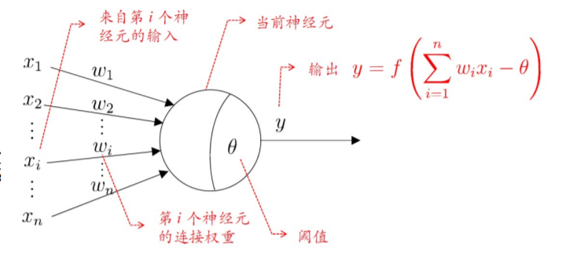

- $n$个输入$x_i$，权值$w_i$
- 阈值
- 激活函数
  - 阶跃函数$sgn$
  - $sigmoid$函数

- 单个神经元
  - 阶跃函数：感知机
  - $sigmoid$函数：对数几率回归
- 多个神经元
  - 神经网络

#### 2、感知机

激活函数为$sgn$(阶跃函数)的神经元
$$
y={\rm sgn}(\overrightarrow w^{\rm T}\overrightarrow x-\theta)=\begin{cases}
1,& w^{\rm T}\overrightarrow x-\theta\geqslant0\\
0,& w^{\rm T}\overrightarrow x-\theta<0
\end {cases}
$$
其中$\overrightarrow x\in \R^n$为样本特征向量，$\overrightarrow w,\theta$是感知机模型的参数（权重和阈值）

**从几何角度看**，就是给定一个线性可分的数据集$T$，感知机的目标就是求得能对数据集$T$中的正负样本完全正确划分的**超平面**，其中$\overrightarrow w^{\rm T}\overrightarrow x-\theta$即为超平面方程，也就是说，求$\overrightarrow w$和$\theta$，使得代入任意一个$\overrightarrow x_i$，都能将其正确分类（正还是负）

- n维空间的超平面$(\overrightarrow w^{\rm T}\overrightarrow x + b=0,其中\overrightarrow w,\overrightarrow x\in\R^n)$

  - 超平面方程不唯一
  - 法向量$\overrightarrow w$垂直于超平面
  - 法向量$\overrightarrow w$和位移项$b$确定一个唯一的超平面
  - 法向量$\overrightarrow w$指向的那一半空间为正空间，另一半为负空间（正空间的点代入超平面方程>0，负空间的点代入超平面方程<0）

- 感知机学习策略：

  - 随机初始化$\overrightarrow w,b$，将全体训练样本代入模型找出**误分类样本**，记为集合$M$，也就是$M$中任何一个$(\overrightarrow x,y)$，感知机的输出值$\hat y$和真实值$y$相反（一个为0，一个为1），所以下式恒成立
    $$
    (\hat y-y)(\overrightarrow w^{\rm T}\overrightarrow x-\theta)\geqslant0
    $$
    所以，给定数据集$T$，其损失函数可以定义为
    $$
    L(\overrightarrow w,\theta)=\sum_{\overrightarrow x\in M}(\hat y-y)(\overrightarrow w^{\rm T}\overrightarrow x-\theta)
    $$
    显然该损失函数非负。且如果没有误分类点，$M$就是空集，损失函数值就是0，

    而且，误分类点越少，误分类点离超平面越近，损失函数值就越小

  - 将$\overrightarrow w,\overrightarrow x$扩一下，即
    $$
    -\theta=-1·w_{n+1}=x_{n+1}w_{n+1}
    $$
    也就是$\overrightarrow w,\overrightarrow x$各加一项$w_{n+1}=\theta,x_{n+1}=-1$

    要求解的极小化问题就化为
    $$
    \min_{\overrightarrow w}L(\overrightarrow w)=\min_{\overrightarrow w}\sum_{\overrightarrow x\in M}(\hat y_i-y_i)\overrightarrow w^{\rm T}\overrightarrow x
    $$

  - 感知机的学习算法：**随机梯度下降**：不是依次使$M$中的所有误分类点的梯度$(\sum(\hat y_i-y_i)\overrightarrow x_i)$下降，而是一次随机选取一个误分类点使其梯度$((\hat y_i-y_i)\overrightarrow x_i)$下降，所以权重$\overrightarrow w$的更新公式为
    $$
    \overrightarrow w \leftarrow \overrightarrow w+\Delta\overrightarrow w\\
    \Delta\overrightarrow w=-\eta(\hat y_i-y_i)\overrightarrow x_i=\eta(\hat y_i-y_i)\overrightarrow x_i
    $$

    - 不过最后解出来的$\overrightarrow w$不唯一，因为能划分这个样本的超平面不唯一

#### 3、神经网络

感知机只能对线性可分的数据集进行分类，而对于多个神经元构成的神经网络，就能够对线性不可分的数据进行分类

通用近似定理：只需一个包含足够多神经元的隐层，多层前馈网络就能以任意精度逼近任意复杂度的连续函数

但是这只是理论上的，神经网络现在还有几个问题需要解决：

- 具体场景下，神经网络应该做多深？多宽？

- 具体场景下，神经网络的结构应该如何设计才最合理？

- 具体场景下，神经网络的输出结果应该如何解释？（为啥输出的是这个`label`?根据什么特征？不像是线性回归中，我们知道各个特征对应的权值，可以解释哪个特征的影响大，哪个影响小）

- **多层前馈网络**：每一层的神经元都与下一层的全相连，同一层的不连接，也不存在跨层连接

  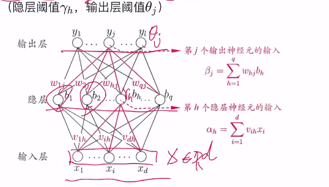

  输入层没有激活函数，隐层和输出层有

- 将$NN$看作一个特征加工函数
  $$
  \overrightarrow x\in\R^d\rightarrow NN(\overrightarrow x)\rightarrow \overrightarrow y=\overrightarrow x^*\in\R^l
  $$
  即将$d$维的输入$x$加工成$l$维的输出$y$

  - 单输出回归任务：后面再接一个$\R^l\rightarrow \R$的神经元，比如没有激活函数的神经元$y=\overrightarrow w^{\rm T}\overrightarrow x^*b$

  - 分类：后面再接一个$\R^l\rightarrow [0,1]$的神经元，比如激活函数为$sigmoid$函数的神经元
    $$
    y=\frac1{1+e^{\overrightarrow w^{\rm T}\overrightarrow x^*+b}}
    $$
    然后用交叉熵或极大似然估计的损失函数$E(w,b)$训练

  - 在模型训练过程中，$NN$会自动学习提取有用的特征（因为要优化损失函数，就必须要有好的$\overrightarrow x^*$，那么就会强迫机器选择有用特征）

  - 推导一下误差逆传播（$BP$）算法

    - 假设多层前馈网络中激活函数全是$sigmoid$函数$f$，当前要完成一个多输出的回归任务（对照上面的参考图），损失函数用均方误差（分类任务就用交叉熵）。对于某个训练样本$(\overrightarrow x_k,\overrightarrow y_k)$，其中$\overrightarrow y_k=(y_1^k,y_2^k,...,y_l^k)$，假定其多层前馈网络的输出为$\overrightarrow{\hat y}_k=(\hat y_1^k,\hat y_2^k,...,\hat y_l^k)$，则随机梯度下降中使用单个样本的均方误差为
      $$
      E_k=\frac12\sum_{j=1}^l(\hat y_j^k-y_j^k)^2
      $$
      这里乘的$\frac12$是为了求导的时候会有个$2$乘下来消掉用的

      那么基于随机梯度下降的参数更新：
      $$
      \overrightarrow w \leftarrow \overrightarrow w+\Delta\overrightarrow w\\
      \Delta\overrightarrow w=-\eta\nabla_{\overrightarrow w}E
      $$
      其中$\nabla_{\overrightarrow w}E$就是损失函数$E$关于参数$\overrightarrow w$的一阶偏导数

      不过，$NN(\overrightarrow x)$通常是极其复杂的**非凸函数**，所以随机梯度下降不能保证一定能走到全局最小值点，而是局部极小值点

      

      下面以输入层第$i$个神经元与隐层第$h$个神经元之间的连接权$v_{ih}$为例推导一下, 当前样本$(\overrightarrow x_k,\overrightarrow y_k)$

      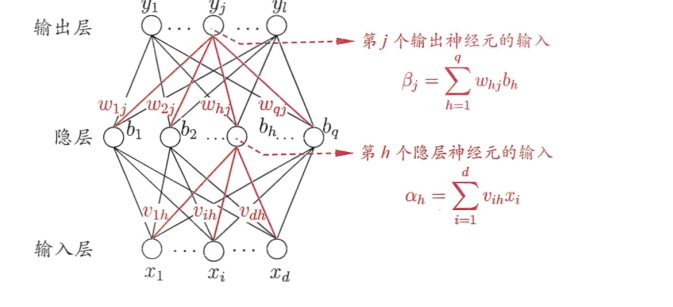

      - 首先我们的损失函数和要更新的值
        $$
        E_k=\frac12\sum_{j=1}^l(\hat y_j^k-y_j^k)^2,\ \Delta v_{ih}=-\eta\frac{\partial E_k}{\partial v_{ih}}
        $$
        损失函数$E_k$与样本输出$\hat y_j^k$有关，而$\hat y_j^k=f(\beta_j-阈值\theta_j)$就是与$\beta_j$有关，而$\beta_j$又和$b_h$有关，$b_h=f(\alpha_h-阈值\gamma_h)$即第$h$个隐层神经元的输入$b_h$又与$\alpha_h$有关，最后$\alpha_h$与$v_{ih}$有关，所以由链式求导法则
        $$
        \frac{\partial E_k}{\partial v_{ih}}=\sum_{j=1}^l\frac{\partial E_k}{\partial\hat y_j^k}·\frac{\partial\hat y_j^k}{\partial\beta_j}·\frac{\partial\beta_j}{\partial b_h}·\frac{\partial b_h}{\partial\alpha_h}·\frac{\partial\alpha_h}{\partial v_{ih}}
        $$
        这里的求和符号依旧保留是因为每一个$\beta_j$都与$b_h$有关（因为全连接）

        计算：
        $$
        \begin{align}
        \frac{\partial E_k}{\partial v_{ih}}&=\sum_{j=1}^l\frac{\partial E_k}{\partial\hat y_j^k}·\frac{\partial\hat y_j^k}{\partial\beta_j}·\frac{\partial\beta_j}{\partial b_h}·\frac{\partial b_h}{\partial\alpha_h}·\frac{\partial\alpha_h}{\partial v_{ih}}\\
        &=\sum_{j=1}^l\frac{\partial E_k}{\partial\hat y_j^k}·\frac{\partial\hat y_j^k}{\partial\beta_j}·\frac{\partial\beta_j}{\partial b_h}·\frac{\partial b_h}{\partial\alpha_h}·x_i\\
        &=\sum_{j=1}^l\frac{\partial E_k}{\partial\hat y_j^k}·\frac{\partial\hat y_j^k}{\partial\beta_j}·\frac{\partial\beta_j}{\partial b_h}·f'(\alpha_h-\gamma_h)·x_i\\
        &=\sum_{j=1}^l\frac{\partial E_k}{\partial\hat y_j^k}·\frac{\partial\hat y_j^k}{\partial\beta_j}·w_{hj}·f'(\alpha_h-\gamma_h)·x_i\\
        &=\sum_{j=1}^l\frac{\partial E_k}{\partial\hat y_j^k}·f'(\beta_j-\theta_j)·w_{hj}·f'(\alpha_h-\gamma_h)·x_i\\
        &=\sum_{j=1}^l(\hat y_j^k-y_j^k)·f'(\beta_j-\theta_j)·w_{hj}·f'(\alpha_h-\gamma_h)·x_i\\
        &注：sigmoid函数求导f'(x)=f(x)(1-f(x))\\
        &=\sum_{j=1}^l(\hat y_j^k-y_j^k)·f'(\beta_j-\theta_j)·w_{hj}·f'(\alpha_h-\gamma_h)·x_i\\
        &=\sum_{j=1}^l(\hat y_j^k-y_j^k)·f(\beta_j-\theta_j)(1-f(\beta_j-\theta_j))·w_{hj}·f(\alpha_h-\gamma_h)(1-f(\alpha_h-\gamma_h))·x_i\\
        &f(\alpha_h-\gamma_h)=b_h,f(\beta_j-\theta_j)=\hat y_j^k\\
        &=\sum_{j=1}^l(\hat y_j^k-\hat y_j^k)·y_j^k(1-\hat y_j^k)·w_{hj}·b_h(1-b_h)·x_i\\
        \end{align}
        $$

### 六、支持向量机

从几何角度，对线性可分的数据集，找到一个距离正负样本都最远的超平面（和感知机只要找到一个能分割的超平面即可不同），这个超平面是唯一的，不偏不倚，泛化性能更好

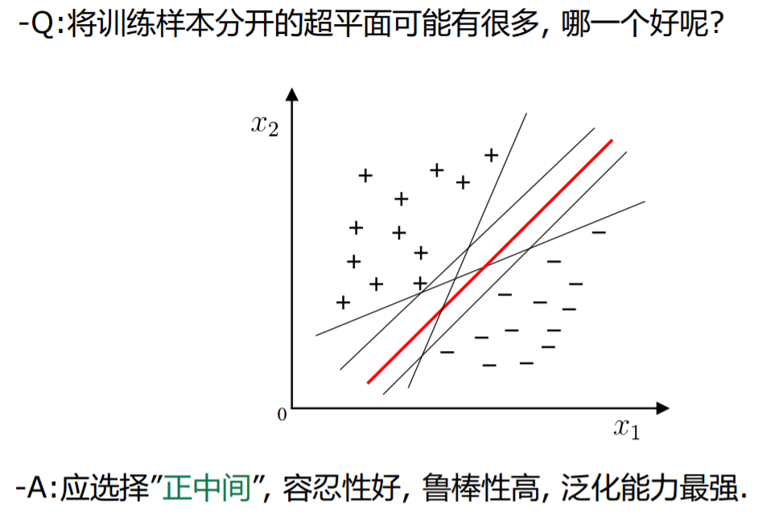

前面我们知道，一个超平面由其法向量$\overrightarrow w$和位移项$b$决定 $n维超平面(\overrightarrow w^{\rm T}\overrightarrow x + b=0,其中\overrightarrow w,\overrightarrow x\in\R^n)$

任意点$\overrightarrow x$到超平面的距离公式为
$$
r=\frac{|\overrightarrow w^{\rm T}\overrightarrow x + b|}{||\overrightarrow w||}
$$

- 接下来我们对于给定数据集$X$和超平面$\overrightarrow w^{\rm T}\overrightarrow x + b=0$，定义$X$中任意一个样本点$(\overrightarrow x_i,y_i),y_i\in\{-1,1\}$，这里正例为1，负例为**-1**，方便后面计算，那么该样本点关于超平面的**几何间隔**为
  $$
  \gamma_i=\frac{y_i(\overrightarrow w^{\rm T}\overrightarrow x_i + b)}{||\overrightarrow w||}
  $$
  可以发现，正确分类时，$\gamma_i>0$，并且也等于点$\overrightarrow x_i$到超平面的距离

  未正确分类时，$\gamma<0$

- 我们再定义数据集$X$关于超平面的几何间隔为：数据集中所有样本点的几何间隔最小值
  $$
  \gamma=\min_{i=1,2,...,m}\gamma_i
  $$

- 支持向量机模型：给定线性可分数据集$X$，希望求得$X$关于超平面的**几何间隔$\gamma$最大**的那个超平面$\overrightarrow w^{\rm T}\overrightarrow x + b=0$，然后套上一个$sign$函数实现分类
  $$
  y={\rm sign}(\overrightarrow w^{\rm T}\overrightarrow x + b)=\begin{cases}
  1,&\overrightarrow w^{\rm T}\overrightarrow x + b>0\\
  -1,&\overrightarrow w^{\rm T}\overrightarrow x + b<0
  \end{cases}
  $$
  所以本质和感知机类似，要求一个超平面

  - 策略：给定线性可分数据集$X$，设$X$中几何间隔最小的样本为$\overrightarrow x_{min},y_{min}$，那么支持向量机找超平面的过程可以转化为一下带约束条件的优化问题
    $$
    \max\ \gamma\\
    {\rm s.t.}\ \gamma_i\geqslant\gamma,\ \ i=1,2,...,m\\
    即\\
    \max_{\overrightarrow w,b}\ \frac{y_{\min}(\overrightarrow w^{\rm T}\overrightarrow x_{min} + b)}{||\overrightarrow w||}\\
    {\rm s.t.}\ \frac{y_i(\overrightarrow w^{\rm T}\overrightarrow x_i + b)}{||\overrightarrow w||}\geqslant \frac{y_{\min}(\overrightarrow w^{\rm T}\overrightarrow x_{min} + b)}{||\overrightarrow w||},\ i=1,2,...,m\\
    即\\
    \max_{\overrightarrow w,b}\ \frac{y_{\min}(\overrightarrow w^{\rm T}\overrightarrow x_{min} + b)}{||\overrightarrow w||}\\
    {\rm s.t.}\ {y_i(\overrightarrow w^{\rm T}\overrightarrow x_i + b)}\geqslant {y_{\min}(\overrightarrow w^{\rm T}\overrightarrow x_{min} + b)},\ i=1,2,...,m
    $$
    但是，如果只靠上述约束条件，解出的$(\overrightarrow w^*,b^*)$不一定是唯一最优解（因为$(\alpha\overrightarrow w^*,\alpha b^*)$同乘上一个正系数，也是最优解），所以不妨令${y_{\min}(\overrightarrow w^{\rm T}\overrightarrow x_{min} + b)}=1$，所以优化问题进一步转化为
    $$
    \max_{\overrightarrow w,b}\ \frac{1}{||\overrightarrow w||}相当于\min_{\overrightarrow w,b}\ ||\overrightarrow w||\\
    {\rm s.t.}\ {y_i(\overrightarrow w^{\rm T}\overrightarrow x_i + b)}\geqslant 1,相当于1-{y_i(\overrightarrow w^{\rm T}\overrightarrow x_i + b)}\leqslant 0,\ i=1,2,...,m
    $$
    相当于
    $$
    \min_{\overrightarrow w,b}\ \frac12||\overrightarrow w||^2\\
    {\rm s.t.}\ 1-{y_i(\overrightarrow w^{\rm T}\overrightarrow x_i + b)}\leqslant 0,\ i=1,2,...,m
    $$
    支持向量机通常用**拉格朗日对偶**来求解

    先看一下凸优化问题的概念

    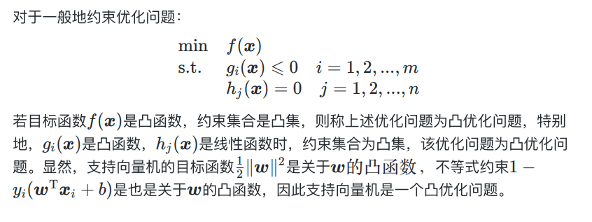

    然后是一般约束优化问题

    

    注意：可行集和定义域举例：$g_i(x)=lnx\geqslant0$，定义域为$x>0$，可行域时$x\geqslant1$

    下面是拉格朗日对偶函数的定义

    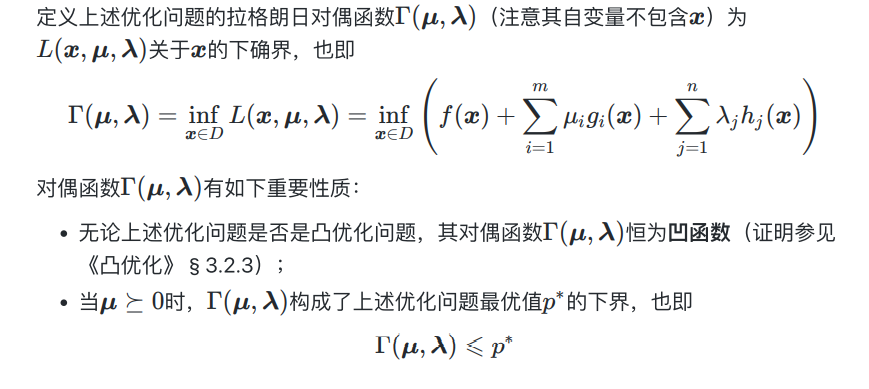

    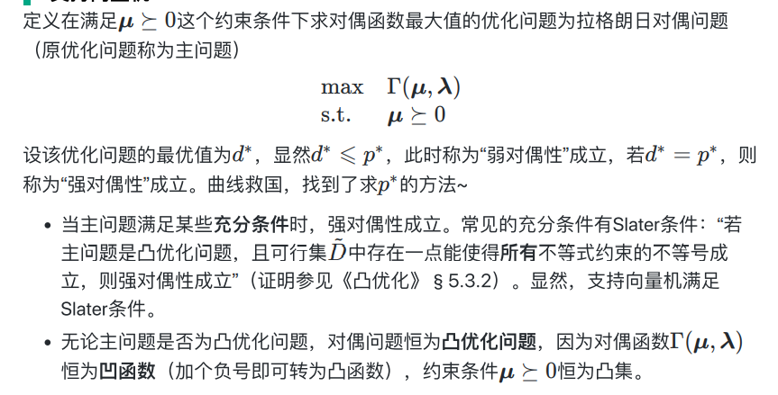

    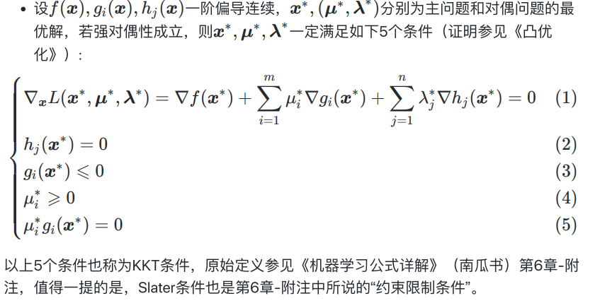

  - 有了概念之后，我们就来解优化问题了：

    - 主问题：
      $$
      \min_{\overrightarrow w,b}\ \frac12||\overrightarrow w||^2\\
      {\rm s.t.}\ 1-{y_i(\overrightarrow w^{\rm T}\overrightarrow x_i + b)}\leqslant 0,\ i=1,2,...,m
      $$

    - 拉格朗日函数：
      $$
      L(\overrightarrow w,b,\overrightarrow \alpha)=\frac12||\overrightarrow w||^2+\sum_{i=1}^m\alpha_i-\sum_{i=1}^m\alpha_iy_i\overrightarrow w^{\rm T}\overrightarrow x_i-b\sum_{i=1}^m\alpha_iy_i
      $$
      将$\overrightarrow w,b$合并为${\overrightarrow {\hat w}}=(\overrightarrow w,b)$，上式就是关于$\overrightarrow {\hat w}$的凸函数，直接求一阶导等于0解出$\overrightarrow {\hat w}$，代回即可得到最小值，也就是拉格朗日对偶函数

  - 还有一种方法获得对偶函数：

    - 上述拉格朗日函数为关于$\overrightarrow w$的凸函数，关于$b$的线性函数，当$b$的一次项系数不为0时，下确界是$-\infin$，系数为0是下确界就完全由$\overrightarrow w$的项决定，所以上述拉格朗日函数的下确界（对偶函数）为
      $$
      \Tau(\overrightarrow \alpha)=\begin{cases}\inf_{\overrightarrow w}\{\frac12||\overrightarrow w||^2+\sum_{i=1}^m\alpha_i-\sum_{i=1}^m\alpha_iy_i\overrightarrow w^{\rm T}\overrightarrow x_i\},&if\ \sum_{i=1}^m\alpha_iy_i=0\\
      -\infin,&otherwise
      \end{cases}\\
      上述花括号内的式子对\overrightarrow w求导并令导数等于0：\\
      \overrightarrow w-\sum_{i=1}^m\alpha_iy_i\overrightarrow x_i=0得\\
      \overrightarrow w=\sum_{i=1}^m\alpha_iy_i\overrightarrow x_i\\
      再代回原式：\\
      \Tau(\overrightarrow \alpha)=\begin{cases}\inf_{\overrightarrow w}\{\sum_{i=1}^m\alpha_i-\frac12\sum_{i=1}^m\sum_{j=1}^m\alpha_i\alpha_jy_iy_j\overrightarrow x_i^{\rm T}\overrightarrow x_j\},&if\ \sum_{i=1}^m\alpha_iy_i=0\\
      -\infin,&otherwise
      \end{cases}\\
      $$

    - 就变成了如下的对偶问题：
      $$
      \max_{\overrightarrow \alpha}\sum_{i=1}^m\alpha_i-\frac12\sum_{i=1}^m\sum_{j=1}^m\alpha_i\alpha_jy_iy_j\overrightarrow x_i^{\rm T}\overrightarrow x_j\\
      {\rm s.t.}\sum_{i=1}^m\alpha_iy_i=0,\ \alpha_i\geqslant0
      $$
      
    - 本来求解$\overrightarrow w$的复杂度是和样本特征成正比，转化成求解$\overrightarrow \alpha$的复杂度是样本数量
    
    - 根据强对偶性成立推得最优解满足一下$KKT$条件
      $$
      \alpha_i\geqslant0\\
      y_if(\overrightarrow x_i)-1\geqslant0\\
      \alpha_i(y_if(\overrightarrow x_i)-1)=0
      $$
      

- **软间隔与正则化**

  - 我们之前讨论的都是数据集线性可分的情况，但是现实中线性不可分才是最常见的，因此需要**允许支持向量机犯错**。当然核函数中低维空间线性不可分可以找到高维空间的线性可分，但是容易过拟合（可能只是因为几个异常样本导致线性不可分，但是映射到高维空间就会容易过拟合）

    - 从数学角度，**软间隔**就是允许尽可能少部分样本不满足约束条件
      $$
      \min_{\overrightarrow w,b}\ \frac12||\overrightarrow w||^2\\
      {\rm s.t.}\ 1-{y_i(\overrightarrow w^{\rm T}\overrightarrow x_i + b)}\leqslant 0,\ i=1,2,...,m\\即y_i(\overrightarrow w^{\rm T}\overrightarrow x_i + b)\geqslant1
      $$
      将严格的约束条件转化成具有一定灵活性的损失（允许样本越过自己类别的界），合格的损失函数要求如下

      ​		当满足约束条件时，损失为0

      ​		当不满足约束条件时，损失>0

      ​		（可选）当不满足约束条件时，**损失与其违反约束条件的程度成正比**

    - 优化问题可以写为
      $$
      \min_{\overrightarrow w,b}\frac12||\overrightarrow w||^2+C\sum_{i=1}^ml_{0/1}(y_i(\overrightarrow w^{\rm T}\overrightarrow x_i + b)-1)
      $$
      其中$l_{0/1}$是"0/1损失函数"
      $$
      l_{0/1}(z)=\begin{cases}
      1,&if\ z<0 //不满足约束条件，即要计算软间隔损失\\
      0,&if\ z\geqslant0\ //满足约束条件
      \end{cases}
      $$
      $C$是常数，用来调节损失的权重，当$c\rightarrow{+\infin}$时，会迫使所有样本的损失为0（不然就炸了），进而退化为硬间隔问题
      
    - 但是，$l_{0/1}$函数非凸、非连续，数学性质不好，上式不太容易求解，因此常用一些数学性质交好的“替代损失函数”来代替它，软间隔支持向量机通常采用**`hinge`（合页）**损失
      $$
      hinge损失：l_{hinge}(z)=\max(0,1-z)
      $$
      $z\geqslant1$，也就是$y_i(\overrightarrow w^{\rm T}\overrightarrow x_i + b)\geqslant1$时，满足约束条件，此时损失为$0$
    
      替换进上式得
      $$
      \min_{\overrightarrow w,b}\frac12||\overrightarrow w||^2+C\sum_{i=1}^m\max(0,1-y_i(\overrightarrow w^{\rm T}\overrightarrow x_i + b))
      $$
    
    - 引入松弛变量$\xi_i=\max(0,1-y_i(\overrightarrow w^{\rm T}\overrightarrow x_i + b)$，则上述优化问题变成：
      $$
      \min_{\overrightarrow w,b,\xi_i}\frac12||\overrightarrow w||^2+C\sum_{i=1}^m\xi_i\\
      {\rm s.t.}\ y_i(\overrightarrow w^{\rm T}\overrightarrow x_i + b)\geqslant1-\xi_i\\
      \xi_i\geqslant 0,i=1,2,...,m
      $$
      为什么会有这样的约束条件：
      $$
      显然\xi_i\geqslant0\\
      而\xi_i=\max(0,1-y_i(\overrightarrow w^{\rm T}\overrightarrow x_i + b)，即\\1-y_i(\overrightarrow w^{\rm T}\overrightarrow x_i + b)>0时，1-y_i(\overrightarrow w^{\rm T}\overrightarrow x_i + b)=\xi_i;\\
      1-y_i(\overrightarrow w^{\rm T}\overrightarrow x_i + b)\leqslant0时，\xi_i=0，所以\\
      1-y_i(\overrightarrow w^{\rm T}\overrightarrow x_i + b)\leqslant\xi_i即\\
      y_i(\overrightarrow w^{\rm T}\overrightarrow x_i + b)\geqslant1-\xi_i
      $$
      可以发现之前硬间隔得约束条件是$y_i(\overrightarrow w^{\rm T}\overrightarrow x_i + b)\geqslant1$，也就是说，我们加上的这个“松弛变量”，就是允许约束条件松一点，而这个松的程度也决定了损失的大小（成线性关系）
  
- **支持向量回归`SVR`**：相比于线性回归用一条线来拟合训练样本，`SVR`采用一个以$f(\overrightarrow x)=\overrightarrow w^{\rm T}\overrightarrow x + b$为中心，宽度为$2\epsilon$的**间隔带**来拟合训练样本

  - 落在间隔带上的样本不计算损失(类比线性回归在线上的点预测误差为0)，不在带子上的以偏离带子的距离作为损失(类似线性回归的均方误差)，然后以最小化损失的方式迫使间隔带从样本最密集的地方穿过

  - 所以优化问题可以写为
    $$
    \min_{\overrightarrow w,b}\frac12||\overrightarrow w||^2+C\sum_{i=1}^ml_{\epsilon}(f(\overrightarrow x_i)-y_i)
    $$
    其中$l_\epsilon(z)$为”$\epsilon$不敏感损失函数“，类比均方误差损失
    $$
    l_\epsilon(z)=\begin{cases}
    0,&if\ |z|\leqslant\epsilon\\
    |z|-\epsilon,&if\ |z|>\epsilon
    \end{cases}
    $$
    而$\frac12||w||^2$为$L2$正则项（后面会学到），起正则化作用，并且也能和`SVM`的优化目标保持形式上的一致（这也是不用均方误差的原因），就可以导出对偶问题引入核函数

  - 同软间隔`SVM`，引入松弛变量$\xi_i=l_{\epsilon}(f(\overrightarrow x_i)-y_i)$，显然$\xi_i\geqslant0$

    当$|f(\overrightarrow x_i)-y_i|\leqslant\epsilon$时，$\xi_i=0$

    当$|f(\overrightarrow x_i)-y_i|>\epsilon$时，$\xi_i=|f(\overrightarrow x_i)-y_i|-\epsilon$

    所以
    $$
    |f(\overrightarrow x_i)-y_i|-\epsilon\leqslant\xi_i即|f(\overrightarrow x_i)-y_i|\leqslant\epsilon+\xi_i，所以\\
    -\epsilon-\xi_i\leqslant f(\overrightarrow x_i)-y_i\leqslant\epsilon+\xi_i
    $$
    那么`SVR`优化问题可以写为：
    $$
    \min_{\overrightarrow w,b,\xi_i}\frac12||\overrightarrow w||^2+C\sum_{i=1}^m\xi_i\\
    {\rm s.t.}-\epsilon-\xi_i\leqslant f(\overrightarrow x_i)-y_i\leqslant\epsilon+\xi_i\\
    \xi_i\geqslant0,i=1,2,...,m
    $$
    如果考虑两边采用不同的松弛程度
    $$
    \min_{\overrightarrow w,b,\xi_i,\hat\xi_i}\frac12||\overrightarrow w||^2+C\sum_{i=1}^m\xi_i\\
    {\rm s.t.}-\epsilon-\hat\xi_i\leqslant f(\overrightarrow x_i)-y_i\leqslant\epsilon+\xi_i\\
    \xi_i,\hat\xi_i\geqslant0,i=1,2,...,m
    $$

### 七、贝叶斯分类器

#### 1、贝叶斯决策论

是概率框架下实施决策的基本方法，对分类任务来说，就是在**所有相关概率**都已知的理想情形下，贝叶斯决策论考虑如何基于这些**概率**和**误判损失**来选择最优的类别标记

- 以$N$分类任务为例：$y=\{c_1,c_2,...,c_N\}$，定义$\lambda_{ij}$是将真实标记为$c_j$的样本误分类为$c_i$所产生的损失（惩罚）

  - 定义单个样本$\overrightarrow x$被分到第$i$类的**期望损失（条件风险）**为
    $$
    R(c_i|\overrightarrow x)=\sum_{j=1}^N\lambda_{ij}P(c_j|\overrightarrow x)
    $$
    

    其中$P(c_j|\overrightarrow x)$为后验概率，即看到$\overrightarrow x$的值后其真实类别为$c_j$的概率
    
  - 定义全部样本构成的总体风险为
    $$
    R(h)={\rm E}_x[R(h(x)|x)]
    $$
    其中$h$为分类器模型，分类效果越准确的$h$，其条件风险和总体风险越小

- 贝叶斯判定准则：为最小化总体风险$R(h)$，只需在每个样本上选择哪个能使条件风险$R(c|\overrightarrow x)$最小的类别标记，即让每个条件风险最小化
  $$
  h^*(\overrightarrow x)=\arg\min_{c\in y}R(c|\overrightarrow x)
  $$
  此时，程$h^*$为贝叶斯最优分类器

- 具体地，目标是最小化分类错误率时，误判损失$\lambda_{ij}$可写为
  $$
  \lambda_{ij}=\begin{cases}
  0,&if\ \ i=j\\
  1,&otherwise
  \end{cases}
  $$
  此时单个样本$\overrightarrow x$的条件风险为
  $$
  R(c_i|\overrightarrow x)=\sum_{j=1}^N\lambda_{ij}P(c_j|\overrightarrow x)\\
  =1*P(c_1|\overrightarrow x)+...+1*P(c_{i-1}|\overrightarrow x)+0*P(c_i|\overrightarrow x)+...+1*P(c_{N}|\overrightarrow x)
  $$
  又$\sum_{j=1}^NP(c_j|\overrightarrow x)=1$，则
  $$
  R(c_i|\overrightarrow x)=1-P(c_i|\overrightarrow x)
  $$

  - 那么根据贝叶斯判定准则，最优分类器为
    $$
    \begin{align}
    h^*(\overrightarrow x)&=\arg\min_{c\in y}R(c|\overrightarrow x)\\
    &=\arg\min_{i\in\{1,2,...,N\}}R(c_i|\overrightarrow x)\\
    &=\arg\min_{i\in\{1,2,...,N\}}(1-P(c_i|\overrightarrow x))\\
    &=\arg\max_{i\in\{1,2,...,N\}}P(c_i|\overrightarrow x)\\
    &=\arg\max_{c\in y}P(c|\overrightarrow x)
    \end{align}
    $$
    明朗起来了，就是对于每个样本$\overrightarrow x$，选择后验概率$P(c_i|\overrightarrow x)$最大的类别$c_i$作为标记，也就是说，我们要让真实标记$c_j$的后验概率$P(c_j|\overrightarrow x)$变大，也就是，让分类器将样本标记正确的概率越大，大过标记成其他任何一个错误样本的概率，因为根据贝叶斯判定准则，我们的分类器要选择概率最大的那个标记作为预测标记

    再换句话说，这个准则就证明了：最大化真实标记的后验概率，相当于是在最小化条件风险！

- 判别式模型：给定$\overrightarrow x$，直接建模$P(c|\overrightarrow x)$来预测$c$(即建模得到所有的$P(c_i|\overrightarrow x),i=1,2,...,N$，选出最大的那个$c_i$作为该样本的标记)

- 生成式模型：先对联合概率$P(\overrightarrow x,c)$建模，然后再由此推导出$P(c|\overrightarrow x)$

  - 建模思路
    $$
    P(c|\overrightarrow x)=\frac{P(\overrightarrow x,c)}{P(\overrightarrow x)}
    $$
    再根据贝叶斯定理
    $$
    P(c|\overrightarrow x)=\frac{P(c)P(\overrightarrow x|c)}{P(\overrightarrow x)}
    $$
    其中$P(c)$是类先验概率，比如说根据历史经验来看一个瓜是好瓜的概率是0.8

    $P(\overrightarrow x|c)$是样本$\overrightarrow x$相对于类别标记$c$的类条件概率，比如说我在知道这个瓜是好瓜的前提下，它的各类特征是$\overrightarrow x$的概率

    $P(\overrightarrow x)$是用于归一化的“证据”因子，也就是对所有的类别$c$都相同，那么上式只要考察$P(c)$和$P(\overrightarrow x|c)$，特别是$P(\overrightarrow x|c)$，因为比如说特征$\overrightarrow x$有$d$维，每个特征又有$t$种取值，那么可能的样本取值就有$d·t$个，通常都很大，但是样本数量$m$可能会比$d·t$小得多，穷举样本的话得出的概率很可能并不具有说服性

  - **朴素贝叶斯**
  
    - 这里要用到一个**属性条件独立性假设**：对已知类别，假设**所有属性相互独立**，那么对于一个$d$维样本$\overrightarrow x=(x_1,x_2,...,x_d)$，$x_i$为样本在第$i$个属性上的取值，有
      $$
      P(c|\overrightarrow x)=\frac{P(c)P(\overrightarrow x|c)}{P(\overrightarrow x)}=\frac{P(c)}{P(\overrightarrow x)}\prod_{i=1}^dP(x_i|c)
      $$
      根据贝叶斯判定准则
      $$
      h^*(\overrightarrow x)=\arg\max_{c\in y}P(c|\overrightarrow x)=\arg\max_{c\in y}\frac{P(c)}{P(\overrightarrow x)}\prod_{i=1}^dP(x_i|c)
      $$
      那么又因为所有类别的$P(\overrightarrow x)$都相同，所以可以把它去掉：
      $$
      h_{nb}(\overrightarrow x)=\arg\max_{c\in y}{P(c)}\prod_{i=1}^dP(x_i|c)
      $$
      接下来看下如何算$P(c)$和$P(x_i|c)$
  
      - 对于$P(c)$，基于大数定律，即用频率近似估计概率
        $$
        P(c_i)=\frac{|D_{c_i}|}{|D|}
        $$
        $D_{c_i}$为训练集$D$中类别真实标记为$c_i$的样本集合
  
      - 对于$P(x_i|c)$，
  
        - 第$i$个属性为离散属性：
          $$
          P(x_i|c)=\frac{|D_{c,x_i}|}{|D_c|}
          $$
          其中$D_{c,x_i}$为$D_c$中在第$i$个属性上取值为$x_i$的样本集合
  
        - 第$i$个属性为连续属性（以正态分布假设为例）：
          $$
          p(x_i|c)=\frac1{\sqrt{2\pi}\sigma_{c,i}}\exp(-\frac{(x_i-\mu_{c,i})^2}{2\sigma_{c,i}^2})
          $$
          其中$\mu_{c,i},\sigma_{c,i}$分别为第$c$类样本在第$i$个属性上取值的均值和方差（极大似然估计）
  
  - **半朴素贝叶斯分类器**：适当考虑一部分属性间的相互依赖关系，从而既不需要进行完全联合概率计算，又不至于完全忽略了一些比较强的属性依赖关系；比如说身高和体重多多少少有些内在联系，朴素贝叶斯就完全把这两个特征割裂开，这里半朴素的就要适当考虑一下联系
  
    - **独依赖估计（ODE）**：假设**每个属性在类别之外最多依赖于一个其他属性**，即
      $$
      P(c|\overrightarrow x)\ ∝\ {P(c)}\prod_{i=1}^dP(x_i|c,pa_i)
      $$
      这里用了正比符号，因为去掉了分母$P(\overrightarrow x)$；其中$pa_i$为属性$x_i$所依赖的属性，称为$x_i$的父属性
  
    - **超父独依赖估计`（SPODE）`**：假设**所有属性都依赖于同一个“超父”属性**
      $$
      \begin{align}
      P(c|\overrightarrow x)&=\frac{P(\overrightarrow x,c)}{P(\overrightarrow x)}=\frac{P(c,x_i)P(x_1,...,x_{i-1},x_{i+1},...,x_d|c,x_i)}{P(\overrightarrow x)}\\
      &∝P(c,x_i)P(x_1,...,x_{i-1},x_{i+1},...,x_d|c,x_i)\\
      &=P(c,x_i)\prod_{j=1}^dP(x_j|c,x_i)
      \end{align}
      $$
      其中，$x_i$是“超父属性”

### 八、集成学习

#### 1、个体与集成的概念

- 集成学习通过集合**多个个体学习器**（例如`LR, SVM, 决策树等`）的结果来提升预测结果的准确性和泛化能力

  - 和而不同：每个个体学习器比随机猜想强（即泛化误差小于0.5），且个体学习器的预测结果之间需要有一定的多样性，满足这两个条件的集成学习才有效

- 集成学习器的收敛性保证（二分类问题）
  $$
  P(H(\overrightarrow x)\neq f(\overrightarrow x))=\sum_{k=0}^{\lfloor T/2 \rfloor}C_T^k(1-\epsilon)^k\epsilon^{T-k}\leqslant\exp(-\frac12T(1-2\epsilon)^2)
  $$
  其中$H(\overrightarrow x)$为集成多个学习器，

  $f(\overrightarrow x)$为样本$\overrightarrow x$的真实标记，

  $T$为个体学习器的数量，

  $\epsilon$为个体学习器的误差，即$P(h_i(\overrightarrow x)\neq f(\overrightarrow x))=\epsilon$，即编号为$i$的分类器将样本$\overrightarrow x$预测错误的概率为$\epsilon$

  上式也就是$k$个学习器错误预测样本$\overrightarrow x$的概率（$T$个学习器至少要有$\lceil T/2\rceil$个正确预测了样本，最后集成才会选择这个正确结果，也就是当至多有$\lfloor T/2 \rfloor$个学习器预测正确时，集成结果会是错误的）

  - 对于这个关于$T$和$\epsilon$的函数，我们希望它的值越小越好，
    - 那也就是对于$T$，希望它越大越好。也就是说，集成学习器的收敛速度随着个体学习器的数量$T$呈指数上升
    - 对于$(1-2\epsilon)^2$也是希望越大越好，可以发现，$\epsilon=0.5$的个体学习器对收敛没有作用（也就是随机猜想，一群人一起随机猜是0还是1，跟一个人随机猜，概率一样）
      - 但是$\epsilon>0.5$时也会收敛的更快，为什么？ 答案其实就是，把结果取个反就行了
- 但是可以发现，上面的分析必须建立在这个假设的前提下：每个基学习器的误差相互独立；
  
  - 现实生活中，这些基学习器都为了解决同一个问题被训练出来，显然不可能相互独立
  
- 经典算法

  - **Adaboost算法**

    $T$个个体学习器，$h_t$对应权重$\alpha_t$，集成结果加权和
    $$
    H(\overrightarrow x)=\sum_{t=1}^T\alpha_th_t(\overrightarrow x)
    $$
    来最小化损失函数
    $$
    l_{\exp}(H|D)=E_{\overrightarrow x\sim D}[e^{-f(\overrightarrow x)H(\overrightarrow x)}]
    $$
    其中二分类问题$真实结果f(\overrightarrow x)\in \{-1,1\},集成结果H(\overrightarrow x)\in \{-1,1\}$所以它们两式相乘只有两种结果：-1和1，并且当集成结果与正确结果相等时为1，不相等时为-1

    所以将$e^{-f(\overrightarrow x)H(\overrightarrow x)}$定为损失函数，而这个损失函数是定义在所有的样本上的，所以取个期望

    - 之前我们处理优化目标可以直接对损失函数求偏导（这里就应该是$H$）等于0来做，但是这里集成学习是多个个体学习器（也就是$H$由一系列的$h$和$\alpha$构成，不太好直接求偏导），所以需要用其他的方法来求（比如下面是通过一个一个求$h$和$\alpha$）

    - **前向分布求解算法：**（将同时优化多个学习器和对应权重，变成一个一个优化）每一轮只学习一个学习器$h_t$和相应权重$\alpha_t$，第$t$轮的优化目标
      $$
      (\alpha_t,h_t)=\arg\min_{\alpha,h}l_{\exp}(H_{t-1}+\alpha h|D)
      $$
      当我们在优化第$t$轮时，前$t-1$轮被优化的$t-1$个学习器和对应权值已经是最优的，故$H_{t-1}$也已经确定是最优的，那么这一轮就是要找到这样的$\alpha_t,h_t$，使得$l_{\exp}(H_{t-1}+\alpha_th_t)$最小

      根据上面的指数损失函数
      $$
      \begin{align}
      l_{\exp}(H_{t-1}+\alpha h|D)&=E_{\overrightarrow x\sim D}e^{-f(\overrightarrow x)(H_{t-1}(\overrightarrow x)+\alpha h(\overrightarrow x))}\\
      &=\sum_{i=1}^{|D|}D(\overrightarrow {x_i})e^{-f(\overrightarrow {x_i})(H_{t-1}(\overrightarrow {x_i})+\alpha h(\overrightarrow {x_i}))}\\
      &=\sum_{i=1}^{|D|}D(\overrightarrow {x_i})e^{-f(\overrightarrow {x_i})H_{t-1}(\overrightarrow {x_i})}e^{-f(\overrightarrow {x_i})\alpha h(\overrightarrow {x_i})}
      \end{align}
      $$
      其中$D(\overrightarrow {x_i})$记为$\overrightarrow{x_i}$在数据集$D$中所占的比率

      又上面提到$f(\overrightarrow {x_i})·h(\overrightarrow {x_i})\in\{-1,1\}$，那么
      $$
      e^{-f(\overrightarrow {x_i})\alpha h(\overrightarrow {x_i})}=\begin{cases}
      e^{-\alpha},&f(\overrightarrow {x_i})=h(\overrightarrow {x_i})时\\
      e^\alpha,&f(\overrightarrow {x_i})\neq h(\overrightarrow {x_i})时
      \end{cases}\\
      即\\
      \begin{align}
      e^{-f(\overrightarrow {x_i})\alpha h(\overrightarrow {x_i})}&=e^{-\alpha}Ⅱ(f(\overrightarrow {x_i})=h(\overrightarrow {x_i}))+e^\alphaⅡ(f(\overrightarrow {x_i})\neq h(\overrightarrow {x_i}))\\\\
      &=e^{-\alpha}Ⅱ[(f(\overrightarrow {x_i})=h(\overrightarrow {x_i})+Ⅱ(f(\overrightarrow {x_i})\neq h(\overrightarrow {x_i}))-Ⅱ(f(\overrightarrow {x_i})\neq h(\overrightarrow {x_i}))]+e^\alphaⅡ(f(\overrightarrow {x_i})\neq h(\overrightarrow {x_i}))\\\\
      &=e^{-\alpha}[1-Ⅱ(f(\overrightarrow {x_i})\neq h(\overrightarrow {x_i}))]+e^\alphaⅡ(f(\overrightarrow {x_i})\neq h(\overrightarrow {x_i}))\\\\
      &=e^{-\alpha}-e^{-\alpha}Ⅱ(f(\overrightarrow {x_i})\neq h(\overrightarrow {x_i}))+e^\alphaⅡ(f(\overrightarrow {x_i})\neq h(\overrightarrow {x_i}))\\\\
      &=e^{-\alpha}+(e^\alpha-e^{-\alpha})Ⅱ(f(\overrightarrow {x_i})\neq h(\overrightarrow {x_i}))
      \end{align}
      $$
      那么上面的指数损失函数可以化为
      $$
      \begin{align}
      l_{\exp}(H_{t-1}+\alpha h|D)&=\sum_{i=1}^{|D|}D(\overrightarrow {x_i})e^{-f(\overrightarrow {x_i})H_{t-1}(\overrightarrow {x_i})}e^{-f(\overrightarrow {x_i})\alpha h(\overrightarrow {x_i})}\\
      &=\sum_{i=1}^{|D|}D(\overrightarrow {x_i})e^{-f(\overrightarrow {x_i})H_{t-1}(\overrightarrow {x_i})}[e^{-\alpha}+(e^\alpha-e^{-\alpha})Ⅱ(f(\overrightarrow {x_i})\neq h(\overrightarrow {x_i}))]\\
      &=\sum_{i=1}^{|D|}D(\overrightarrow {x_i})e^{-f(\overrightarrow {x_i})H_{t-1}(\overrightarrow {x_i})}e^{-\alpha}+\sum_{i=1}^{|D|}D(\overrightarrow {x_i})e^{-f(\overrightarrow {x_i})H_{t-1}(\overrightarrow {x_i})}(e^\alpha-e^{-\alpha})Ⅱ(f(\overrightarrow {x_i})\neq h(\overrightarrow {x_i}))
      
      \end{align}
      $$
      再令$D'_t(\overrightarrow {x_i})=D(\overrightarrow {x_i})e^{-f(\overrightarrow {x_i})H_{t-1}(\overrightarrow {x_i})}$那么又可以化简成：
      $$
      l_{\exp}(H_{t-1}+\alpha h|D)=e^{-\alpha}\sum_{i=1}^{|D|}D'_t(\overrightarrow {x_i})+(e^\alpha-e^{-\alpha})\sum_{i=1}^{|D|}D'_t(\overrightarrow {x_i})Ⅱ(f(\overrightarrow {x_i})\neq h(\overrightarrow {x_i}))
      $$
      **我们的目的是求解$h_t$使得$l_{\exp}$最小化**，因此忽略掉与$h_t$无关的项，即求解目标为
      $$
      h_t=\arg\min_{h}\sum_{i=1}^{|D|}D'_t(\overrightarrow {x_i})Ⅱ(f(\overrightarrow {x_i})\neq h(\overrightarrow {x_i}))
      $$
      (把前面的系数$e^\alpha-e^{-\alpha}$去掉是因为$\alpha>\frac12$，所以该系数恒大于0)

      该式的形式也很好，相当于考察所有的样本，将学习器预测结果和真实结果不同的样本按占总体的比例加起来，符合我们的逻辑

      求解上式，一般都是直接对$h$求导，导数等于0获得解，但是还有个小小的不同，就是这里对样本是有一个加权的限制

      观察$D'_t(\overrightarrow {x_i})=D(\overrightarrow {x_i})e^{-f(\overrightarrow {x_i})H_{t-1}(\overrightarrow {x_i})}$

      发现该式只与$t-1$轮及以前的学习器有关，也就是说，求解$h_t$时，$D'_t(\overrightarrow {x_i})$已经是个确定的值了，然后我们就把它看成是样本$i$在第$t$轮学习时的权重分布来求解$h_t$

      同时，为了确保$D'_t(\overrightarrow {x_i})$是一个分布，通常要对其**规范化**后作为下一个学习器的输入样本权重，即$D_t(\overrightarrow {x_i})=\frac{D'_t(\overrightarrow {x_i})}{\sum_{i=1}^{|D|}D'_t(\overrightarrow {x_i})}$

      更有意思的是，第$t$轮的样本权重可以通过第$t-1$轮的结果算得，无需从头算起
      $$
      D'_t(\overrightarrow {x_i})=D(\overrightarrow {x_i})e^{-f(\overrightarrow {x_i})H_{t-1}(\overrightarrow {x_i})}\\
      其中H_{t-1}(\overrightarrow {x_i})=\sum_{j=1}^{t-1}\alpha_jh_j(\overrightarrow {x_i})\\
      那么有\\
      \begin{align}
      D'_t(\overrightarrow {x_i})&=D(\overrightarrow {x_i})e^{-f(\overrightarrow {x_i})H_{t-1}(\overrightarrow {x_i})}\\
      &=D(\overrightarrow {x_i})e^{-f(\overrightarrow {x_i})[H_{t-2}(\overrightarrow {x_i})+\alpha_{t-1}h_{t-1}(\overrightarrow {x_i})]}\\
      &=D(\overrightarrow {x_i})e^{-f(\overrightarrow {x_i})H_{t-2}(\overrightarrow {x_i})}e^{\alpha_{t-1}h_{t-1}(\overrightarrow {x_i})}\\
      发现D(\overrightarrow {x_i})e^{-f(\overrightarrow {x_i})H_{t-2}(\overrightarrow {x_i})}&=D'_{t-1}(\overrightarrow{x_i})\\
      则D'_t(\overrightarrow {x_i})&=D'_{t-1}(\overrightarrow{x_i})e^{\alpha_{t-1}h_{t-1}(\overrightarrow {x_i})}
      \end{align}
      $$

    - 上面是求解$h_t$的方法，下面求解$\alpha_t$

      损失函数
      $$
      l_{\exp}(H_{t-1}+\alpha h|D)=e^{-\alpha}\sum_{i=1}^{|D|}D'_t(\overrightarrow {x_i})+(e^\alpha-e^{-\alpha})\sum_{i=1}^{|D|}D'_t(\overrightarrow {x_i})Ⅱ(f(\overrightarrow {x_i})\neq h(\overrightarrow {x_i}))
      $$
      对$\alpha$求导为
      $$
      \begin{align}
      \frac{\partial l_{\exp}(H_{t-1}+\alpha h|D)}{\partial\alpha}&=
      -e^{-\alpha}\sum_{i=1}^{|D|}D'_t(\overrightarrow {x_i})+(e^\alpha+e^{-\alpha})\sum_{i=1}^{|D|}D'_t(\overrightarrow {x_i})Ⅱ(f(\overrightarrow {x_i})\neq h(\overrightarrow {x_i}))
      \end{align}
      $$
      令导数为0，移项可得：
      $$
      \begin{align}
      \frac{e^{-\alpha}}{e^{\alpha}+e^{-\alpha}}&=\frac{\sum_{i=1}^{|D|}D'_t(\overrightarrow {x_i})Ⅱ(f(\overrightarrow {x_i})\neq h(\overrightarrow {x_i}))}{\sum_{i=1}^{|D|}D'_t(\overrightarrow {x_i})}//根据前面规范化公式\\
      &=\sum_{i=1}^{|D|}D_t(\overrightarrow {x_i})Ⅱ(f(\overrightarrow {x_i})\neq h(\overrightarrow {x_i}))//每个预测结果和真实结果不同的样本所占比率相加，自然就是学习器的误差\\
      &=E_{\overrightarrow x\sim D_t}[Ⅱ(f(\overrightarrow {x_i})\neq h(\overrightarrow {x_i}))]=\epsilon_t
      \end{align}
      $$
      最后求解得
      $$
      \alpha_t=\frac12\ln(\frac{1-\epsilon_t}{\epsilon_t})
      $$
      当$\epsilon>\frac12$时，上式单调递减，因此误差率越大的学习器分配的权值越少

#### 2、其他的一些Boosting算法

- Adaboost的假设前提：

  - 二分类任务 $y_i\in\{-1,1\}$
  - 损失函数$e^{-H(x)f(x)}$

- 所以说如果其他多分类或是回归任务，亦或是损失函数不是上述的指数形式，就要用一些其他的算法来求解

- **Gradient Boosting**：即将Adaboost问题一般化，不限定损失函数为指数函数，也不局限于二分类问题，那么更一般的boosting形式：
  $$
  \begin{align}
  l(H_t|D)&=E_{\overrightarrow x\sim D}[{\rm err}(H_t(\overrightarrow x),f(\overrightarrow x))]\\
  &=E_{\overrightarrow x\sim D}[{\rm err}(H_{t-1}(\overrightarrow x)+\alpha_th_t(\overrightarrow x),f(\overrightarrow x))]
  \end{align}
  $$
  也就是说，损失函数是**集成学习的结果和样本真实标签间的 误差期望**，不过好消息是，前$t$个学习器的集成结果可以像Adaboost中那样前向分布，即用前$t-1$个学习器的集成结果迭代求得

  比如说研究的是回归问题时，$真实标签f(\overrightarrow x)\in \R$且损失函数为平方损失函数，即${\rm err}(H_t(\overrightarrow x),f(\overrightarrow x))=(H_t(\overrightarrow x)-f(\overrightarrow x))^2$

  - **Gradient Boosting**具体算法：

    将${\rm err}(H_t(\overrightarrow x),f(\overrightarrow x))$在$H_t(\overrightarrow x)=H_{t-1}(\overrightarrow x)$处泰勒展开：

    （泰勒展开公式：$f(x)\approx f(x_0)+f'(x_0)(x-x_0)$）
    $$
    {\rm err}(H_t(\overrightarrow x),f(\overrightarrow x))\approx {\rm err}(H_{t-1}(\overrightarrow x),f(\overrightarrow x))+\frac{\partial{\rm err}(H_t(\overrightarrow x),f(\overrightarrow x))}{\partial H_t(\overrightarrow x)}|_{H_t(\overrightarrow x)=H_{t-1}(\overrightarrow x)}(H_t(\overrightarrow x)-H_{t-1}(\overrightarrow x))
    $$
    可以发现，$H_t(\overrightarrow x)-H_{t-1}(\overrightarrow x)=\alpha_th_t(\overrightarrow x)$

    则损失函数可以化为
    $$
    \begin{align}
    l(H_t|D)
    &=E_{\overrightarrow x\sim D}[{\rm err}(H_t(\overrightarrow x),f(\overrightarrow x))]\\
    &=E_{\overrightarrow x\sim D}[{\rm err}(H_{t-1}(\overrightarrow x),f(\overrightarrow x))+\frac{\partial{\rm err}(H_t(\overrightarrow x),f(\overrightarrow x))}{\partial H_t(\overrightarrow x)}|_{H_t(\overrightarrow x)=H_{t-1}(\overrightarrow x)}\alpha_th_t(\overrightarrow x)]\\
    &=E_{\overrightarrow x\sim D}[{\rm err}(H_{t-1}(\overrightarrow x)+\alpha_th_t(\overrightarrow x),f(\overrightarrow x))]+E_{\overrightarrow x\sim D}[\frac{\partial{\rm err}(H_t(\overrightarrow x),f(\overrightarrow x))}{\partial H_t(\overrightarrow x)}|_{H_t(\overrightarrow x)=H_{t-1}(\overrightarrow x)}\alpha_th_t(\overrightarrow x)]
    \end{align}
    $$
    左边$E_{\overrightarrow x\sim D}[{\rm err}(H_{t-1}(\overrightarrow x),f(\overrightarrow x))]$是上一轮已经求得的定值，所以只要看后面一项，要求得使得后面一项最小的$h_t(\overrightarrow x)$和$\alpha_t$，先不看$\alpha_t$，只考虑$h_t$，有
    $$
    h_t(\overrightarrow x)=\arg\min_{h}E_{\overrightarrow x\sim D}[\frac{\partial{\rm err}(H_t(\overrightarrow x),f(\overrightarrow x))}{\partial H_t(\overrightarrow x)}|_{H_t(\overrightarrow x)=H_{t-1}(\overrightarrow x)}h(\overrightarrow x)]
    $$
    解得$h_t(\overrightarrow x)$后，再求解如下优化问题求得权重$\alpha_t$
    $$
    \alpha_t=\arg\min_{\alpha}E_{\overrightarrow x\sim D}[{\rm err}(H_{t-1}(\overrightarrow x)+\alpha_th_t(\overrightarrow x),f(\overrightarrow x))]
    $$

  - 以上就是Gradient Boosting的理论框架，即每轮通过梯度下降的方式将$h_0,...,h_t$这些个若学习器提升成强的集成学习器$H_t$，可以看出Adaboost是其特殊形式

### 3、Bagging

前面Boosting算法是一个串行算法，而**Bagging**算法是并行式集成学习的代表

- Boosting：$h_0,...,h_t$可以看成是一个不断优化前者完成的情况和目标间差距的过程

- 而Bagging好比是大家都同时闷头开始做，最后把结果统一处理一下，显然效果不如一个一个串行做，每个人都在前人的基础上优化的效果好；但是关键的问题就是并行能节省大量时间

  - 不过，我们之前提到集成学习的两个要求：个体学习器的效果比随机猜想好；每个个体学习器之间的结果要有差异性。可以看出，Boosting算法的差异性会比Bagging要多一些，因为我是不断在改进前人结果的，而Bagging是大家各做各的，也就是说Bagging的个体间结果的方差可能会低一些，但是与最终目标的偏差会大一些
  - Bagging的思路：对于每个学习器$h_0,...,h_t$，分别从整体样本中抽出一部分子集，给每个个体学习器学习，最终将结果汇总处理。那么一个重点就是，**如何从整体中抽取子集**
  - 要集成学习的效果好，必须个体学习器之间的结果差异性高，那么每个学习器分得的训练子集间的差异也要高一些。

- 一个最简单的数据集划分方法：$t$个个体学习器，直接将整体样本划分成$t$份；但是如果整体样本比较少，每个学习器分得的样本太少，学习得可能会不充分；所以要找到一个既不过分重叠，又不过少的采样方法

  - **自助采样法booststrap sampling**

    从$n$个样本中**有放回**地抽出$n$个样本，$n$次抽样后，有的样本会被重复抽到，有的样本没有被抽到，对于没有被抽到的样本，可以求得它们在总体中的占比：
    $$
    \lim_{n\rightarrow \infin}(1-\frac1n)^n=\frac1e\approx36.6\%
    $$

  - 我们通过$T$次自助采样获得$T$个大小与整体样本相等的数据集给$T$个学习器训练

- **随机森林Random Forest**：是Bagging的一个变体，在以决策树为基学习器构建Bagging集成的基础上，进一步在决策树训练过程中引入了**属性的随机选择**

  - 假设样本包含$d$个属性，对基决策树的每个节点，先从该节点的属性结合中随机选择包含$k$个属性的子集用来进行最优划分。也就是说，每次从决策树确定当前节点如何向下划分时，本来是从多个属性中选出一个最优的，而现在要先**随机屏蔽掉一部分属性**，对未屏蔽的属性们选出最优的划分。
  - 这样做的好处就是，进一步使得个体学习器间的差异变大，那么泛化误差就更小（不易过拟合到训练集上），同时属性少了时间消耗也少了

#### 4、多样性增强：提升个体学习器间的差异性

- 数据样本扰动（像上面那样让输入的数据样本有差异性）
  - 对输入扰动敏感的基学习器：决策树、神经网络等
  - 对输入扰动不敏感的：线性学习器、支持向量机、朴素贝叶斯、$k$近邻等
    - 比如说支持向量机，之前的学习中提到，在支持向量机训练过程中起决定性作用的只有那些离超平面距离最近的那部分样本点，扰动其他点没什么用
- 输入属性扰动
- 输出属性扰动
  - 随机改变一些训练样本的标记
  - Dropout
- 算法参数扰动
  - `L1`、`L2`正则化等